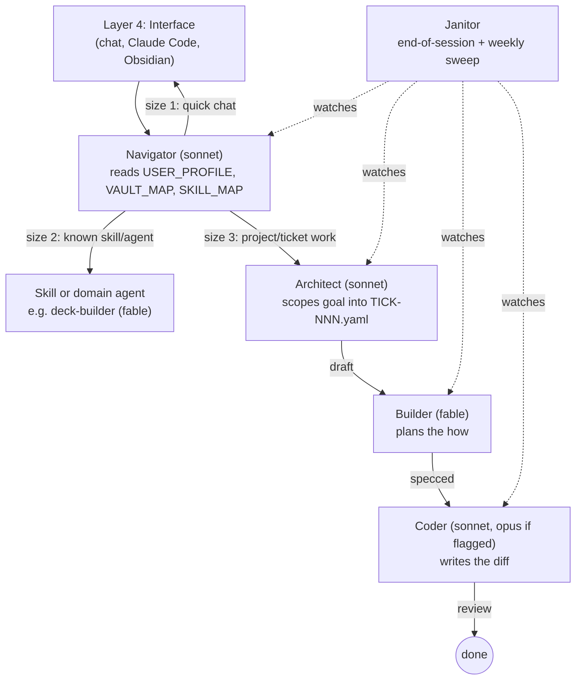

# Flowcharts

> Visual companion to [[FOUNDATION]] and [[PIPELINE]]. Obsidian renders these natively (no plugin needed, Mermaid support is built in). If a diagram and the text docs ever disagree, the text docs win — update this file to match, not the other way around.

## 1. Whole-vault routing (four layers + ticket pipeline)

## 2. Ticket lifecycle

## Links

- [[FOUNDATION]]
- [[PIPELINE]]
- [[TICKET_INDEX]]
- [[MODEL_SELECTOR]]
