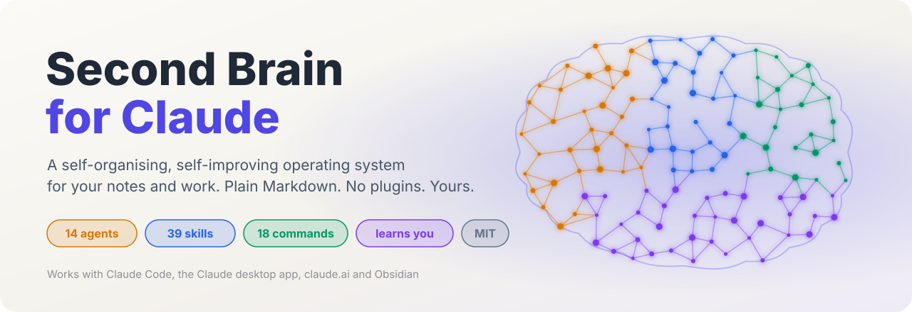
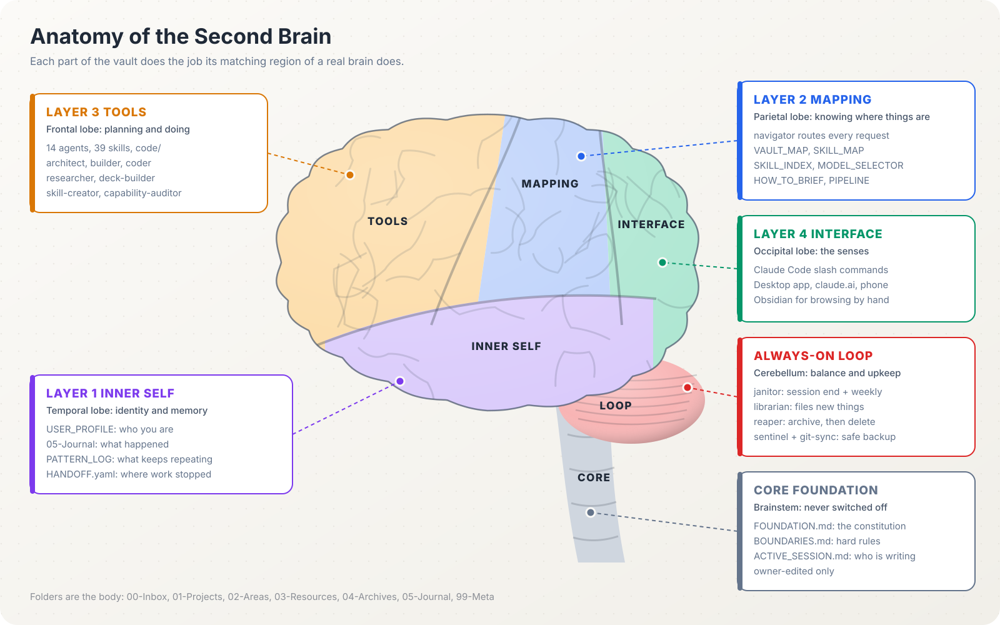
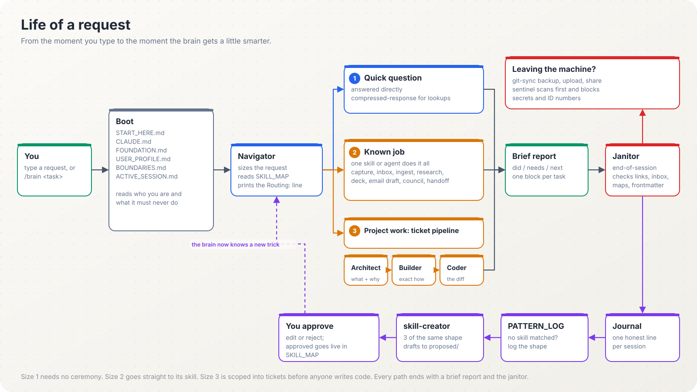
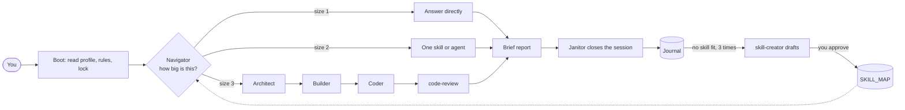
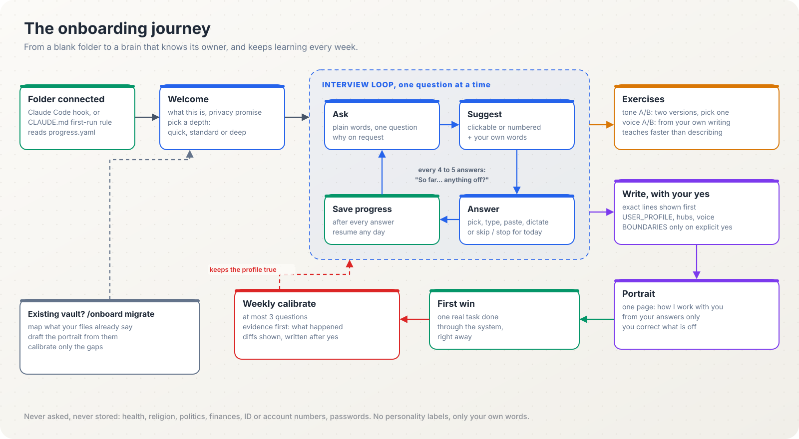
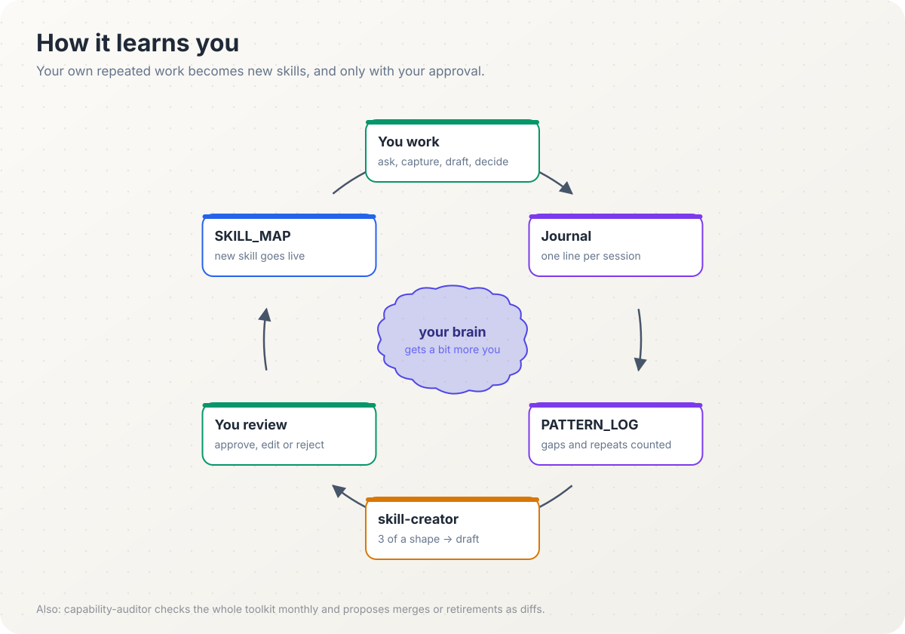

<p align="center">
  
</p>

<p align="center">
  <a href="docs/getting-started.md"><b>Get started</b></a> ·
  <a href="docs/concepts.md">How it works</a> ·
  <a href="docs/agents.md">Agents</a> ·
  <a href="docs/skills.md">Skills</a> ·
  <a href="docs/commands.md">Commands</a> ·
  <a href="docs/prompting-guide.md">Prompt guide</a> ·
  <a href="docs/how-to-use.md">How to use</a> ·
  <a href="docs/packs.md">Packs</a> ·
  <a href="docs/comparison.md">Why different</a> ·
  <a href="docs/roadmap.md">Roadmap</a>
</p>

<p align="center">
  
  
  
  
  
  
</p>

---

## What this is

A folder of Markdown files that turns Claude into a colleague who knows you, follows your rules, and gets better at your work every week.

Most people use AI like a stranger they re-brief every morning. This template gives Claude a written operating charter it reads before it does anything: who you are, what it must never do, where your notes live, and which specialist ("agent" or "skill") handles each kind of request. It routes every request, does the work through a defined procedure, reports back in a short status block, cleans up after itself, and notices when you keep doing the same thing by hand so it can propose a new skill for it.

No plugins, no servers, no database. If Claude can read a folder, it can run your brain: Claude Code in a terminal, the Claude desktop app, claude.ai, or Obsidian open alongside.

> Built and used daily as one person's private vault for three months (job applications, trading, research, coding, presentations), then extracted into this template. Every agent here exists because a real workflow needed it.

## Why it is different

| Typical AI notes setup | This brain |
|---|---|
| Re-explain yourself every chat | Reads your profile, rules and projects at the start of every session |
| One assistant does everything, differently each time | 14 agents with one job each, and a written procedure for each |
| You cannot tell if it followed your setup | Every reply starts with `Routing: <task> -> <agent>`, so you can see it did |
| Notes pile up and rot | A janitor closes every session; a reaper archives, then deletes after a grace period you can veto |
| Secrets end up in git | Sentinel scans everything before it leaves your machine and blocks ID numbers and keys |
| Your workflows live in your head | Repeated work gets logged; three repeats and skill-creator drafts a skill for you to approve |
| Big tasks become one long messy chat | Architect, builder and coder split work into tickets that survive across sessions and models |

More detail, including when something else would suit you better: [docs/comparison.md](docs/comparison.md).

## See it

<p align="center">
  
</p>

The system has four layers plus a loop that never switches off:

| Layer | Brain region | Job | Lives in |
|---|---|---|---|
| 1. Inner self | Temporal lobe | Who you are, how you talk, what you remember | `USER_PROFILE.md`, `05-Journal/`, `PATTERN_LOG.md` |
| 2. Mapping | Parietal lobe | Where things are, who handles what | `VAULT_MAP.md`, `SKILL_MAP.md`, navigator |
| 3. Tools | Frontal lobe | Planning and doing | `99-Meta/agents/`, `99-Meta/skills/`, `skills/`, `code/` |
| 4. Interface | Occipital lobe | How you reach it | slash commands, desktop app, claude.ai, Obsidian |
| Loop | Cerebellum | Balance and upkeep | janitor, librarian, reaper, sentinel, git-sync |
| Core | Brainstem | Rules that never switch off | `FOUNDATION.md`, `BOUNDARIES.md` |

### What happens when you ask for something

<p align="center">
  
</p>



### Who does the work

<p align="center">
  
</p>

### How it gets to know you

<p align="center">
  
</p>

### How it learns you

<p align="center">
  
</p>

## Quick start (5 minutes)

**1. Get your own copy.** Click **Use this template** at the top of this page and create a **private** repository. (Or download the ZIP.) Never put your personal vault in a public repo.

**2. Open it with Claude.** Pick one:

| You use | Do this |
|---|---|
| Claude Code (terminal) | `git clone <your-private-copy> my-brain && cd my-brain && claude` |
| Claude desktop app | Start a conversation, connect the folder, paste the boot prompt below |
| claude.ai | Create a Project, upload `CLAUDE.md` and everything in `99-Meta/`, paste the boot prompt |
| Obsidian | Open the folder as a vault to browse; use one of the above to talk to it |

**3. Let it interview you.** The first time you open the folder, the brain greets you and starts an interview on its own (in Claude Code a start-up hook triggers it; elsewhere `CLAUDE.md` tells it to). You can also type `/onboard`. In the desktop app or claude.ai, send:

```text
This is my second-brain vault. Read 99-Meta/START_HERE.md in full, then FOUNDATION,
USER_PROFILE, BOUNDARIES and ACTIVE_SESSION. Route every request through
99-Meta/SKILL_MAP.md and open the actual agent or skill file before acting.
State routing as the first line. Obey BOUNDARIES. Report in brief format.
Task: run the onboarding interview.
```

Pick a depth: quick (15 minutes), standard (45 minutes) or deep (a few sittings, covering how you think and decide, your writing voice and your goals). It asks one question at a time with suggested answers you can click or ignore, saves progress after every answer so you can stop and resume anytime, shows every line before writing it, and ends with a one-page portrait of how you work for you to correct. After that, `/calibrate` asks two or three tuning questions a week. Every question: [docs/onboarding-interview.md](docs/onboarding-interview.md).

**4. Use it for two weeks with the defaults.** Capture freely, `/inbox` once a day, `/weekly` on Fridays or Sundays. Then let skill-creator propose skills from what you actually did.

Full walkthrough for each path: [docs/getting-started.md](docs/getting-started.md).

## Commands

Slash commands work in Claude Code. On other surfaces, say the same thing in plain words ("process my inbox", "plan this project") and the navigator routes it.

| Command | What it does | Example |
|---|---|---|
| `/brain <task>` | Full boot, routes the task, reports briefly | `/brain summarise this week's client emails into a status note` |
| `/onboard` | First-run interview: quick, standard or deep; resumable; `migrate` for existing vaults | `/onboard deep`, `/onboard resume`, `/onboard migrate` |
| `/calibrate` | Two or three tuning questions based on your week | `/calibrate` |
| `/portrait` | Show and correct the one-page "how I work with you" | `/portrait` |
| `/cold-start` | One-line health check: profile, rules, inbox, journal | `/cold-start` |
| `/daily` | Create or open today's journal, carry over yesterday | `/daily` |
| `/capture <text>` | Drop a thought into the Inbox, no filing decisions | `/capture idea: offer a half-day AI workshop to clients` |
| `/inbox` | Propose a home for every Inbox item, move on approval | `/inbox` |
| `/ingest <url>` | Summarise a page into Resources and link it | `/ingest https://example.com/article` |
| `/research <question>` | Sourced web research, every claim graded | `/research which document-review tools keep data in India?` |
| `/new-project <name>` | Project hub from the template, three questions | `/new-project q4-board-report` |
| `/plan <goal>` | Architect scopes the goal into tickets, no code | `/plan build a script that merges our monthly Excel exports` |
| `/council <decision>` | Five advisors and a verdict for a hard call | `/council should we pilot tool A or build in-house?` |
| `/handoff` | Write or update HANDOFF.yaml for the current project | `/handoff` |
| `/weekly` | Weekly review: wins, blockers, patterns, stale items | `/weekly` |
| `/resume` | Where you left off and the one next move | `/resume` |
| `/janitor` | Full hygiene audit, report first | `/janitor` |
| `/audit` | Audit the agents and skills themselves | `/audit` |
| `/sentinel` | Scan for secrets and ID numbers | `/sentinel` |
| `/ticket-status` | Ticket counts and drift across projects | `/ticket-status` |

Details, variations and what each produces: [docs/commands.md](docs/commands.md).

## What is included

| | Agents | Skills | Where |
|---|---|---|---|
| Core | 14 | 40 | `99-Meta/`, `skills/` |
| Job-search pack | 2 | 7 | `packs/job-search/` |
| LinkedIn pack | 1 | 4 | `packs/linkedin/` |
| Trading pack | 0 | 10 | `packs/trading/` |
| Total | 17 | 61 | plus 20 slash commands |

Every agent and skill file carries a `version:` line (1.0.0; onboard is 2.1.0). Agents also name a model tier; the author ran them on Claude Sonnet 5.5 (fast), Claude Fable 5.1 (careful) and Claude Opus 5.5 (high stakes). Full table and how to remap: [docs/versions.md](docs/versions.md). What each pack does, plus the advanced agents not shipped yet: [docs/packs.md](docs/packs.md).

## What to tell it about you

The onboarding interview asks for how you work, not your biography: your role, your week, your domains, how you want it to write, your hard rules, your current projects, and what you do every week that repeats. It never asks for, and will not store, ID numbers, bank or card details, passwords or client financials. Full list with examples: [docs/profile-guide.md](docs/profile-guide.md).

## Apps and connections

| Need | What |
|---|---|
| Required (one of) | Claude Code, the Claude desktop app, or a claude.ai Project |
| Recommended | Obsidian (free) for browsing, Git with a private GitHub repo for backup, Python 3 for the three small tools |
| Optional connectors | Email, calendar, Drive or SharePoint, Microsoft 365, Claude in Chrome, Excel MCP, web search, market data, job boards |

Start with none of the optional ones; the navigator names a connector when a real task needs it. Details and minimum setups per person: [docs/apps-and-connections.md](docs/apps-and-connections.md).

## What to say to it

You do not need special syntax. A good request has four parts, and only the first is required:

```text
Goal:        what done looks like, in one line
Home:        which project or area (or "new project")
Stakes:      touches real data, money, a client, or something hard to undo?
Constraints: deadlines, decisions already made, things already tried
```

Three sizes, three levels of ceremony:

| Size | Looks like | What happens |
|---|---|---|
| 1. Quick | "What's the difference between an agent and a skill here?" | Straight answer |
| 2. Known job | "Draft a reply to this email, firm but polite" | One skill runs its procedure |
| 3. Project | "I want a weekly dashboard of our pipeline from these three spreadsheets" | Tickets, plan, build, review, handoff |

The [prompt guide](docs/prompting-guide.md) has 70 ready prompts grouped by job: managers and partners, consultants, tax and legal professionals, writers, researchers and students, developers, finance.

## What is inside

```text
.
├── CLAUDE.md              # auto-loaded by Claude Code: read order + routing rule
├── AGENTS.md              # same rules for other AI tools (Codex, Cursor, ChatGPT)
├── 00-Inbox/              # capture zone, cleared within 7 days
├── 01-Projects/           # one folder + _hub.md per project, tickets/ inside
├── 02-Areas/              # ongoing responsibilities
├── 03-Resources/          # reference material, research notes
├── 04-Archives/           # done or dormant, read-only
├── 05-Journal/            # daily notes, weekly reviews, session lines
├── 99-Meta/               # the operating layer
│   ├── START_HERE.md      # entry point for any cold session
│   ├── FOUNDATION.md      # the constitution
│   ├── USER_PROFILE.md    # you (filled by /onboard)
│   ├── BOUNDARIES.md      # hard rules: universal + yours
│   ├── SKILL_MAP.md       # every agent, skill, command: when and when not
│   ├── MODEL_SELECTOR.md  # which model tier does what
│   ├── agents/            # 14 agents
│   ├── skills/            # vault/, workflow/, coding/ skills
│   └── templates/         # daily, project hub, concept, resource, ticket
├── skills/                # 15 portable Claude skills (rename to SKILL.md to install)
├── code/                  # small Python tools: capability scan, ticket sweep, link suggester
├── .claude/commands/      # 20 slash commands
├── packs/                 # optional sub-brains: job-search, linkedin, trading
├── docs/                  # everything you are reading about
└── examples/              # a fictional owner's profile, hub, ticket, journal
```

## Safety, in plain words

- It never deletes a note. Things move to `04-Archives/`; only the reaper deletes, after 30 days, from a list you can veto.
- It never sends, submits, posts, pays or signs for you. It drafts; you press the button.
- Nothing leaves your machine without the sentinel scan. Passport, national ID, PAN, SSN, card and bank numbers, API keys and tokens are blocked and quarantined to `_local-only/`.
- It never writes those numbers into any note in the first place.
- `FOUNDATION.md` and `BOUNDARIES.md` are yours. No agent edits them on its own.
- A kill switch stops every scheduled job: create `_local-only/AUTONOMY_OFF`.

More, including a confidentiality section for consultants, lawyers and accountants: [docs/safety.md](docs/safety.md).

## Documentation

| Read this | If you want to |
|---|---|
| [Getting started](docs/getting-started.md) | Set up your copy on any surface, step by step |
| [How to use it](docs/how-to-use.md) | Four example sessions, start to finish |
| [Concepts](docs/concepts.md) | Understand layers, routing, tickets, sub-brains, with diagrams |
| [Onboarding interview](docs/onboarding-interview.md) | See every question it will ask you and where each answer goes |
| [Agents](docs/agents.md) | Know what each of the 14 agents does, when, and how to call it |
| [Skills](docs/skills.md) | Browse all 40 core skills by group |
| [Packs](docs/packs.md) | Job-search, LinkedIn and trading packs; advanced and retired agents |
| [Versions](docs/versions.md) | File versions, model tiers, current Claude models, design history |
| [What to tell it](docs/profile-guide.md) | What information to give about a person, and what never to give |
| [Apps and connections](docs/apps-and-connections.md) | Required, recommended and optional apps and connectors |
| [Commands](docs/commands.md) | Every slash command with examples |
| [Prompt guide](docs/prompting-guide.md) | Write better requests; copy ready prompts for your role |
| [Workflows](docs/workflows.md) | Daily loop, weekly review, project pipeline, research, writing, decks, backup |
| [Safety](docs/safety.md) | Boundaries, sentinel, confidentiality, unattended runs |
| [Customising](docs/customizing.md) | Add skills, agents, sub-brains; map model tiers; use other AI tools |
| [Use cases](docs/use-cases.md) | How a partner, a consultant, a writer, a student, a developer would use it |
| [How it is different](docs/comparison.md) | Where this sits against chat memory, notes apps, plugins and agent kits |
| [Credits](docs/credits.md) | The repositories and skills it builds on, and what was deliberately left out |
| [FAQ](docs/faq.md) | Troubleshooting and common questions |
| [Roadmap](docs/roadmap.md) | What is new, what is coming, what you could build |
| [Launch kit](docs/launch-kit.md) | How to talk about this project and share it |

## Contributing

Contributions are mostly writing: clearer procedures, new portable skills, better onboarding questions, translations. Read [CONTRIBUTING.md](CONTRIBUTING.md). The one hard rule: never include anything from your own vault. Use made-up examples.

## Credits

Created by [konark20](https://github.com/konark20). Ideas borrowed from obra/superpowers, the llm-council method, stop-slop, Gabberflast's academic-pptx-skill, claude-subconscious and others, all rebuilt as native skills: see [docs/credits.md](docs/credits.md). Built with and for Claude by Anthropic; not an official Anthropic project.

## License

[MIT](LICENSE). Use it, fork it, sell workshops about it. Keep your own vault private.
