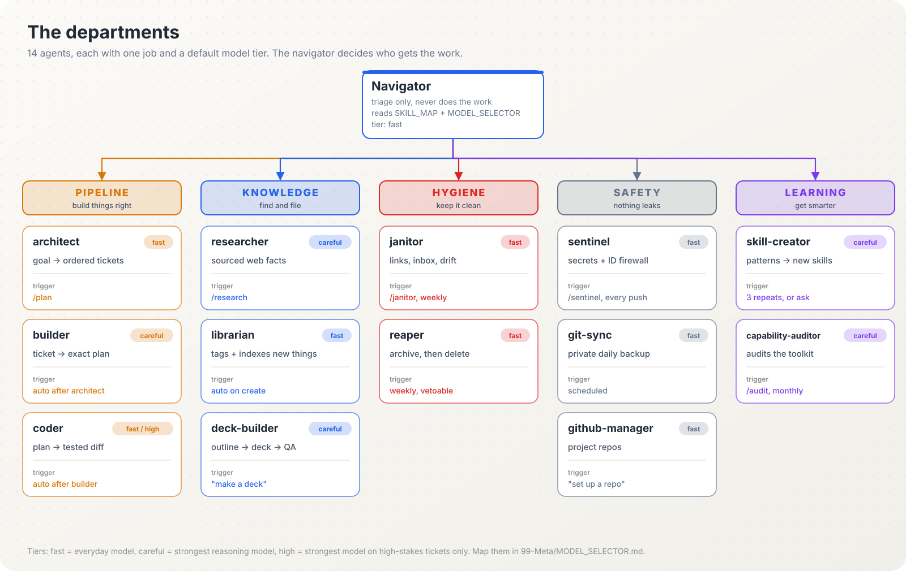
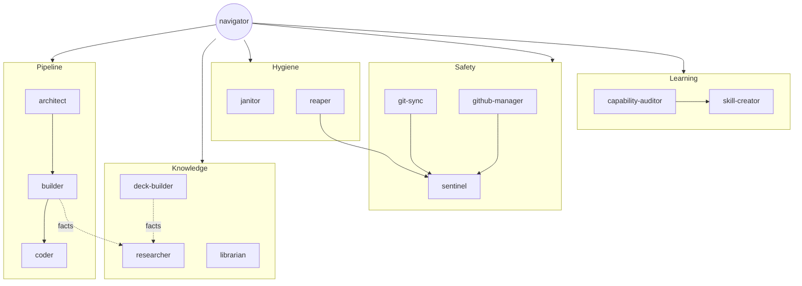

# Agents

Fourteen agents, each with one job, a default model tier, and a written procedure in `99-Meta/agents/<name>.md`. You rarely call them by name; the navigator routes to them. Naming one directly always works too ("have the researcher look into this").





## At a glance

| Agent | Department | Tier | One job | Say |
|---|---|---|---|---|
| navigator | Routing | fast | Decide who handles a request | (automatic) |
| architect | Pipeline | fast | Goal into ordered tickets | "plan this", `/plan` |
| builder | Pipeline | careful | Ticket into an exact plan | "spec TICK-003" |
| coder | Pipeline | fast, high if flagged | Plan into a tested diff | "implement TICK-003" |
| researcher | Knowledge | careful | Verified facts with sources | "research...", `/research` |
| librarian | Knowledge | fast | File, tag and index new things | (automatic) |
| deck-builder | Knowledge | careful | Decks from outline to QA | "make a deck on..." |
| janitor | Hygiene | fast | Keep the vault healthy | `/janitor` |
| reaper | Hygiene | fast | Archive, then delete after a grace period | "clean up" |
| sentinel | Safety | fast | Block secrets and ID numbers | `/sentinel` |
| git-sync | Safety | fast | Private daily backup | "back up the vault" |
| github-manager | Safety | fast | Project repos | "set up a repo for..." |
| skill-creator | Learning | careful | Repeats into new skills | "make me a skill for..." |
| capability-auditor | Learning | careful | Audit the toolkit | `/audit` |

---

## navigator

**Job.** Triage. Reads your profile, the vault map and the skill map, classifies the request (capture, lookup, synthesis, single-skill job, multi-phase work, parallel work), and hands it off. Never does the work itself.

**You see.** The routing line at the top of every substantive reply: `Routing: draft client email -> professional-writing`.

**When nothing fits.** It says "no match, proceeding generically" and logs one line to `PATTERN_LOG.md`. That line is how new skills get born.

**When routing is unclear.** It asks one short question instead of guessing.

## architect

**Job.** Turns a goal into scoped, ordered tickets. What and why, never how. Writes `TICK-NNN.yaml` files with a goal, testable acceptance criteria, files touched, dependencies and what is out of scope, and suggests a model tier for the builder and coder stages.

**Use when.** Anything bigger than a one-sitting task: a tool, a pipeline, a report system, a website, a data cleanup.

**Not when.** One-line fixes. Just do them.

**Prompt.**
```text
/plan a monthly script that merges the three regional Excel exports,
flags duplicates, and writes one clean sheet. Project: ops-reporting.
Stakes: real sales data, never modify the source files.
```

**You get.** A list of tickets, which can run in parallel, and the model each stage will use.

## builder

**Job.** The heavy thinking before code. Explores what exists, resolves unknowns, writes the exact approach, sequence, research notes and risks into the ticket, so a coder with no context can start typing.

**Use when.** A ticket is in `draft` and the approach is not obvious. If research shows the ticket is really two tickets, it says so and sends it back rather than quietly absorbing the scope.

## coder

**Job.** Executes exactly what the builder planned. Diff-only output, tests if the ticket calls for them, a self-correction pass, then moves the ticket to `review`.

**Rule.** If the plan turns out to be wrong, coder stops and kicks it back. It never re-architects mid-code.

**Tier.** Fast by default. In the original author's comparisons, the fast tier matched the top tier on every well-specced coding and debugging ticket. The high-stakes tier is reserved for tickets flagged as risky.

## researcher

**Job.** Turns open questions into verified, sourced findings. Splits the question into 2 to 5 sub-questions, opens real pages (not search snippets), cross-checks, and grades every claim: verified, single-source, or not found.

**Use when.** Any step needs current facts from outside the vault: company background before a proposal, tool comparisons, a regulation's current text, market data.

**Not when.** The answer is already in the vault (search there first), or you have one URL to save (that is `ingest-url`).

**Prompt.**
```text
/research Which document-review AI tools let us keep data in-region,
and what does each cost for 20 users? Sources required.
```

## librarian

**Job.** Files new things properly the moment they are created: consistent tags from `SKILL_INDEX.md`, a row in the right index, proposed links to related notes, a one-paragraph description if missing.

**Difference from janitor.** Librarian is proactive ("is this new thing organised?"). Janitor is reactive ("what broke?").

## deck-builder

**Job.** Owns a slide deck from intake to QA: confirms purpose, audience, register (academic, professional, trading) and time slot; inventories your raw content; drafts a slide-by-slide outline with action titles; gets your approval; builds; checks it.

**Rule.** Outline approval before building anything past about ten slides. Cheap to redirect an outline, expensive to redirect a deck.

**Prompt.**
```text
Make a 12-slide deck for the partners' meeting: Q3 AI pilot results.
Audience: senior, non-technical, 20 minutes. Source: 01-Projects/ai-pilot/.
Lead with the recommendation.
```

## janitor

**Job.** The always-on maintenance loop.

| When | What it checks |
|---|---|
| End of every session | New broken links, notes without frontmatter, inbox items over 7 days, maps needing a row, one journal line |
| Weekly sweep | `lint-vault`, `dedupe`, `archive-stale`, link suggestions into the Inbox |
| `/janitor` | Everything above, plus every skill has a SKILL_MAP row and vice versa |

**Rule.** More than 20 issues: report and wait, never batch-fix.

## reaper

**Job.** The only agent allowed to delete, and only through a lifecycle: active note, then archived with a date, then after 30 days in Archives onto a delete manifest in the Inbox, then deleted only if you did not strike it. Never touches notes marked `status: active` or `keep: true`, and never the operating layer.

## sentinel

**Job.** Identity-document and secrets firewall. Before any commit, push, upload or share it scans file names and contents for passport, national ID, Aadhaar, PAN, SSN, driver's licence, visa and immigration numbers, card and bank numbers, API keys, tokens and private keys.

**On a hit.** Blocks the operation, moves the file to `_local-only/` (never synced), reports the file and the pattern name, never the value.

**On a clean scan.** Silent. It still runs every time.

## git-sync

**Job.** Scheduled, sentinel-gated backup of the vault to your private repository. One job: commit and push. Never merges, rebases, force-pushes or resolves conflicts; if the remote disagrees, it stops and tells you.

## github-manager

**Job.** Creates and maintains project repositories (not the vault backup): README, `.gitignore`, licence, sensible layout, commits, pushes. Proposes the structure before creating a new repo. Sentinel before every push. Never deletes a repo or rewrites history without you naming that action.

## skill-creator

**Job.** The self-improving loop. Reads `PATTERN_LOG.md` and recent journal entries, looks for the same shape three or more times, checks nothing existing already covers it, decides whether it should be a skill (one-shot) or an agent (a standing role), and drafts it into `proposed/`.

**Rule.** Fewer than three occurrences is coincidence. Nothing goes live without your approval.

**Prompt.**
```text
Make me a skill for turning a new tax circular into a one-page client note:
what changed, who is affected, effective date, action needed. Here are two
notes I wrote by hand as examples: ...
```

## capability-auditor

**Job.** Audits the brain's own toolkit as a system. Runs `code/capability-audit/scan.py`, reads every flagged file, and asks four questions of each agent, skill and command: is it reachable, is it used, does it agree with its neighbours, does it still do what it says. Writes an audit report and one diff per proposed fix. Applies nothing without your ok.

**Use.** `/audit` monthly, or after adding several skills.

---

## Pack agents

Three more agents ship in the optional packs: job-coordinator and dossier-keeper (job-search) and linkedin-strategist (linkedin). See [packs.md](packs.md). Version and model for every agent: [versions.md](versions.md).

## Adding your own agent

Ask skill-creator, or write one by hand in `99-Meta/agents/<name>.md` using the format in [customizing.md](customizing.md). Give it one job, a trigger, a "when NOT to use" section, a procedure and a model tier, then add a row to `SKILL_MAP.md` and `MODEL_SELECTOR.md`.
