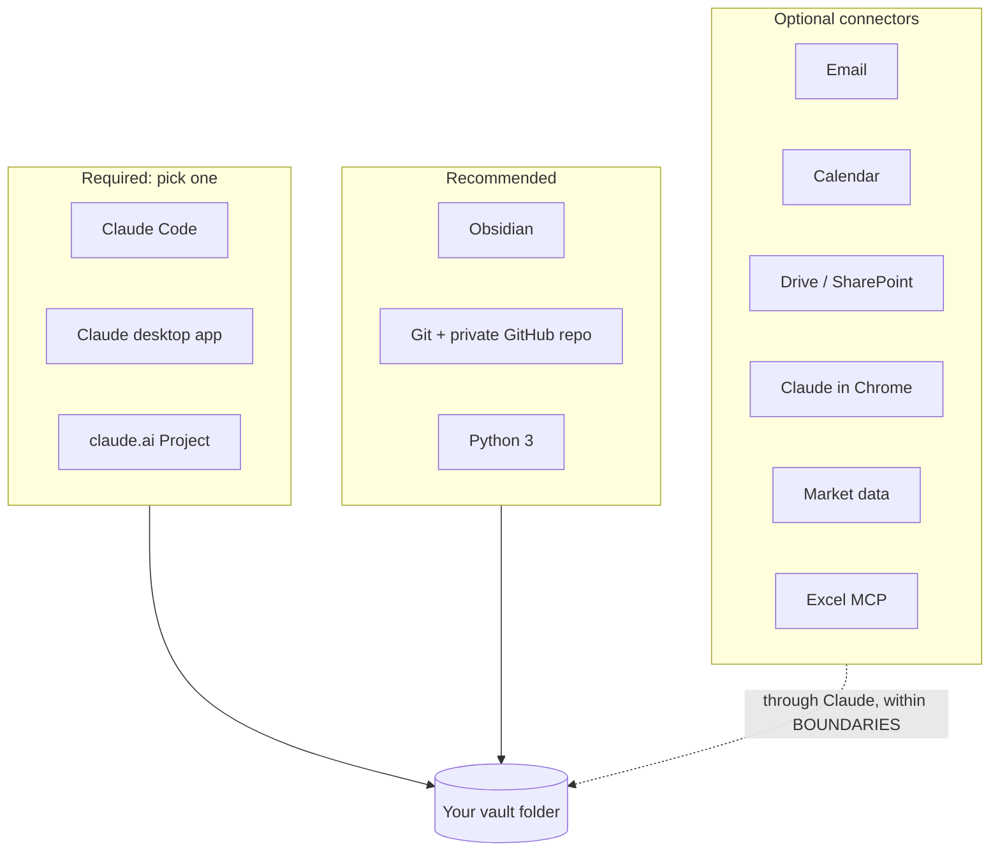

# Apps and connections

What you need, what helps, and what each optional connection unlocks. Nothing here is required beyond a way for Claude to read the folder.

## Required: one way for Claude to read the folder

| App | Best for | Notes |
|---|---|---|
| Claude Code | People comfortable in a terminal; the full experience | Loads `CLAUDE.md` automatically; the 18 slash commands work; can run the Python tools |
| Claude desktop app | Everyone else | Connect the vault folder to a conversation, paste the boot prompt; can read and write files |
| claude.ai Project | Trying it out, or read-mostly use | Upload the operating files; it cannot write to your disk |

## Recommended

| App | Why | Setup |
|---|---|---|
| Obsidian (free) | Browse the vault with backlinks, graph view and rendered diagrams; capture from your phone with Obsidian mobile | Open the folder as a vault. No plugins required |
| Git and a private GitHub repository | Versioned backup; the git-sync agent pushes daily after a sentinel scan | Keep your credential in the system credential store, never in a note |
| Python 3 | Runs the three tools in `code/`: capability scan, ticket sweep, link suggester | Standard library plus pandas for some tools |

## Obsidian plugins (all optional)

The original vault used these. The template works without any of them.

| Plugin | What it adds |
|---|---|
| Dataview | Live tables over frontmatter, for example a ticket board built from ticket files |
| Templater and QuickAdd | Hotkeys that create a daily note, project hub or concept note from `99-Meta/templates/` |
| Excalidraw | Hand-drawn diagrams inside the vault |
| Smart Connections | Semantic "related notes" suggestions alongside the link-suggester |
| A Claude chat plugin | Talk to Claude from inside Obsidian (any plugin that can read the vault works) |

Keep plugin data folders out of git; the shipped `.gitignore` already does.

## Optional connectors

Connectors are added through Claude's own connector settings (or `claude mcp` in Claude Code). Every one is governed by BOUNDARIES: vault content only goes to services you approved, and nothing is sent, posted or submitted on your behalf.

| Connector | Unlocks | Used by |
|---|---|---|
| Email (Gmail or Outlook) | Draft replies from vault context; turn a thread into a note | professional-writing, capture |
| Calendar (Google or Outlook) | `/daily` lists today's meetings and prep lines; meeting notes filed to the right project | daily, project hubs |
| Drive, OneDrive or SharePoint | Ingest documents, not just web pages; read reference material where it already lives | ingest-url, researcher |
| Claude for Microsoft 365 | Work directly in Word, Excel and PowerPoint alongside the vault | deck-builder, data work |
| Claude in Chrome or the desktop app's browser | Read pages that need a login; fill forms you then submit yourself | researcher, job-search pack |
| Excel MCP server (`excel-mcp-server`) | Read and write .xlsx from Claude Code; wired in `.mcp.json` in the original vault | data-analysis-coding |
| Web search and fetch | Sourced research | researcher, web-research |
| Market data (broker, financial data, filings and transcripts) | Prices, positions (read-only), filings for the trading pack | trading pack, researcher |
| Job boards and profile lookup | Job discovery; reading a public profile instead of pasting it | job-search and linkedin packs |
| GitHub | Project repos managed by github-manager | github-manager |

Start with none. Add a connector when a real task needs it; the navigator will name the one that would help.

## Tools some skills call

| Tool | Used for | Needed by |
|---|---|---|
| `pdftotext`, `pdfplumber` | Checking PDFs extract cleanly; mining numbers from reports | job-search pack, number-miner |
| LaTeX (`pdflatex`) | Compiling a LaTeX resume | job-search pack (if your resume is LaTeX) |
| LibreOffice (headless) | Converting .docx back to PDF to check page count | job-search pack |
| Tesseract OCR | Comparing scanned PDFs | optional document tools |
| A terminal multiplexer | Running several agent terminals in parallel | advanced maestro setup (not shipped yet) |

## Scheduled tasks

If your Claude setup supports scheduled tasks, these are the ones worth scheduling. Each logs to the journal and respects the kill switch file.

| Task | When | Does |
|---|---|---|
| skill-sweep | Twice a week, evening | Counts patterns, drafts proposals, refreshes the health snapshot |
| janitor weekly sweep | Sunday | Lint, dedupe, archive proposals, link suggestions |
| ticket-sweep | Daily, early | Ticket status file and drift flags |
| git-sync | Daily, night | Sentinel-gated private backup |

## Minimum setup by person

| Person | Needs |
|---|---|
| Non-technical professional | Claude desktop app + Obsidian. Later: email and calendar connectors |
| Consultant or partner | Desktop app + Obsidian + Microsoft 365 or Google connectors + private backup |
| Developer | Claude Code + Git + Python |
| Job seeker | Desktop app or Claude Code + job-search pack + LaTeX or Word |
| Trader | Claude Code + trading pack + a read-only market-data connector |
