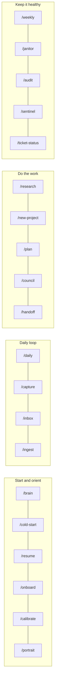

# Commands

Twenty slash commands live in `.claude/commands/`. They work in Claude Code. Each one is a thin pointer to the agent or skill file that actually holds the procedure, so the file stays the single source of truth.

Not using Claude Code? Say the same thing in words. "Process my inbox" routes to the same skill as `/inbox`.



## Start and orient

### `/brain <task>`
Full boot (START_HERE, CLAUDE.md, FOUNDATION, USER_PROFILE, BOUNDARIES, ACTIVE_SESSION), routes the task through SKILL_MAP, prints the routing line, does it, reports in brief format. Use it whenever you want to be sure the whole system is engaged.

```text
/brain turn my notes from today's three client calls into action items per client
```

### `/onboard [quick | standard | deep | resume | redo <module>]`
Runs the first-run interview. On a fresh vault it starts by itself; this command starts or resumes it. One question at a time, suggested answers, progress saved after every answer, a portrait at the end. See [onboarding-interview.md](onboarding-interview.md).

```text
/onboard deep
/onboard resume
/onboard redo communication
```

### `/calibrate`
Two or three tuning questions, each based on something that happened this week (a correction you keep making, a skipped question). Changes shown as diffs first.

### `/portrait`
Shows the one-page "how I work with you" and asks what is wrong or missing.

### `/cold-start`
One-line health check: `loaded: profile ok, boundaries ok, inbox 4 items (oldest 2d), journal exists`.

### `/resume`
Reads the journal, handoff files and any run manifests and answers: what was I doing, and what is the one next move. Separates "waiting on you" from "waiting on an agent".

## Daily loop

### `/daily`
Creates today's journal entry from the template and carries forward yesterday's "Tomorrow" items and open questions in your original words. If today's entry exists it just opens it.

### `/capture <text>`
Drops the text into `00-Inbox/` with frontmatter. No filing decisions, no perfect title.

```text
/capture Ask Priya whether the vendor contract has a data-residency clause
/capture https://example.com/interesting-report  read later, relevant to AI pilot
```

### `/inbox`
For every Inbox item: proposes a destination folder and a filename. You approve, change or skip each one. Target state: empty Inbox.

### `/ingest <url>`
Reads the page and writes a `03-Resources/` note: source, summary, key claims, what holds up, a "my take" placeholder for you, and proposed links to related notes.

## Do the work

### `/research <question>`
Sends the question to the researcher agent: sub-questions, real pages opened, cross-checked, every finding graded verified / single-source / not found, sources listed. Saves a Resources note if it is worth keeping.

```text
/research What changed in India's DPDP rules in 2026 that affects consulting firms
handling client employee data? Primary sources preferred.
```

### `/new-project <name>`
Creates `01-Projects/<slug>/_hub.md` from the template and asks three questions: what does done look like, is there a real deadline, which agents and skills apply.

### `/plan <goal>`
Architect scopes the goal into tickets with acceptance criteria, files touched, dependencies and a suggested model per stage. No code. Follow with "run builder on TICK-001" and "have coder implement TICK-001", or just "carry on".

### `/council <decision>`
Five advisors reason from different angles, review each other, and a chairman gives one recommendation and the strongest argument against it. For real decisions with uncertainty, not for facts.

```text
/council We can either hire a second analyst or buy a document-review tool this quarter.
Budget allows one. Context is in 01-Projects/capacity-2026/_hub.md.
```

### `/handoff`
Writes or updates `HANDOFF.yaml` for the current project: current state, next steps in priority order, key files, how to run things, conventions, errors already solved, a changelog line. Use it before switching models, pausing for a week, or handing to a colleague.

## Keep it healthy

### `/weekly`
Weekly review for the current ISO week plus two standing questions: is anything in your profile no longer true, and which open item should be dropped.

### `/janitor`
Full hygiene audit: broken links, orphans, missing frontmatter, bad dates, Inbox age, map drift, duplicates, stale projects. Report first; only trivially safe fixes are applied. Over 20 issues and it stops to ask.

### `/audit`
The capability auditor checks the agents, skills and commands themselves: reachable, used, consistent, still accurate. Proposals come as diffs; nothing is applied without you.

### `/sentinel`
Scans named files, or everything staged for git, for secrets and ID numbers. Hits are quarantined to `_local-only/` and reported by file and pattern name only.

### `/ticket-status`
Runs `code/ticket-sweep/sweep_tickets.py` and reports tickets by status, open checkbox tasks, and any drift between ticket files and `TICKET_INDEX.md`.

## Adding a command

A command is a Markdown file in `.claude/commands/<name>.md`. Keep it to a few lines that point at the agent or skill file; never copy the procedure into the command, or the two will drift. Add a row to the slash commands table in `99-Meta/SKILL_MAP.md`.

```markdown
Summarise the meeting notes after /minutes with 99-Meta/skills/vault/minutes.md.
Report in brief format.
```
