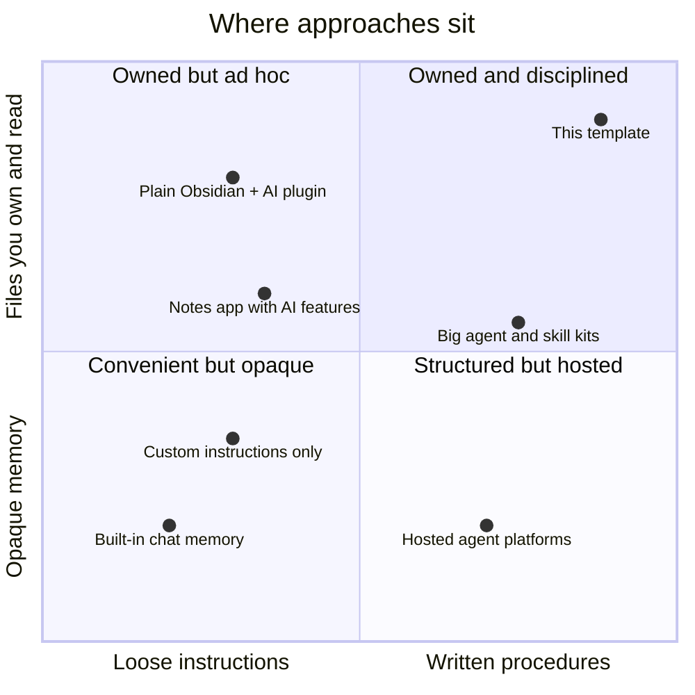

# How this is different

There are many ways to give an AI assistant memory or a notes system. This page explains where this template sits and when something else might suit you better. Descriptions of other approaches are general categories, not reviews of specific products, which change often.

## The landscape

## Compared with common approaches

| Approach | What it does well | Where this template differs |
|---|---|---|
| Built-in chat memory (in Claude or other assistants) | Zero setup; remembers facts across chats | This is files you can read, edit, version and move between tools. It stores procedures, rules and projects, not just facts, and nothing is hidden |
| Custom instructions or a system prompt | Quick tone and preference setup | One prompt cannot hold 60 procedures. Here each job has its own file, opened only when needed, and the routing line shows which was used |
| A notes app with built-in AI | Nice editor, AI summaries inside the app | This is not an editor. It is an operating layer that works with any Claude surface, and the AI follows your written rules rather than generic features |
| Obsidian with an AI chat or semantic-search plugin | Chat with your notes, find related notes | This adds the missing discipline: routing, boundaries, a janitor, a sentinel, tickets, and a loop that turns repeats into skills. You can keep those plugins alongside it |
| Large collections of agents and skills | Breadth; many ready-made tools | This is deliberately small and one-job-per-file, with "when NOT to use" on every skill so they do not collide. It grows from your own repeated work, reviewed by you, rather than bulk-installed |
| Cloud memory services for coding agents | Automatic cross-session memory | Continuity here comes from your own journal and handoff files, with nothing sent to a third-party memory service |
| Hosted agent platforms and automations | Integrations, triggers, dashboards | This runs where your files are, with you approving anything that leaves the machine. No platform account, no lock-in |

## Seven things that are unusual here

1. **Visible routing.** Every substantive reply starts with `Routing: <task> -> <agent or skill>`. You can audit the system at a glance.
2. **Rules that beat requests.** BOUNDARIES wins over any instruction, including yours in the moment, and the brain cites the file when it refuses.
3. **Drafts only, by design.** It never sends, submits, posts or pays. That is a universal rule, not a setting.
4. **A sentinel on the way out.** ID numbers, card numbers and keys are blocked before any push or upload.
5. **Thinking separated from typing.** Architect, builder and coder split big work so the expensive step never runs on a vague plan, and any model can pick up a ticket.
6. **It learns you, with consent.** Gaps are logged, three repeats become a draft skill, you approve it. The toolkit is audited monthly for overlap and dead weight.
7. **Plain Markdown.** No plugin, no server, no database. It survives changes of app, model or company.

## When something else is better

- You want zero setup and only need it to remember a few facts: built-in memory is enough.
- You want a polished writing app first and AI second: use a notes app with AI features.
- You need team-wide automations across dozens of SaaS tools: a hosted automation platform fits better. You can still use this brain for your own thinking and drafting.
- You will not spend 30 minutes on onboarding: the brain will work, but it will not be yours.
