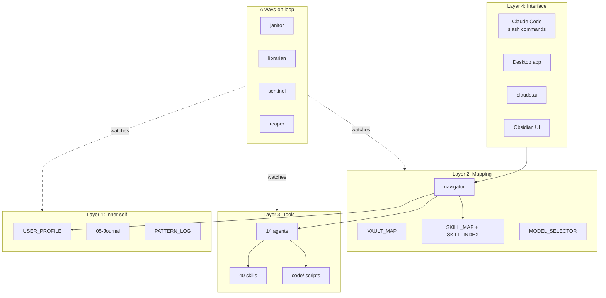
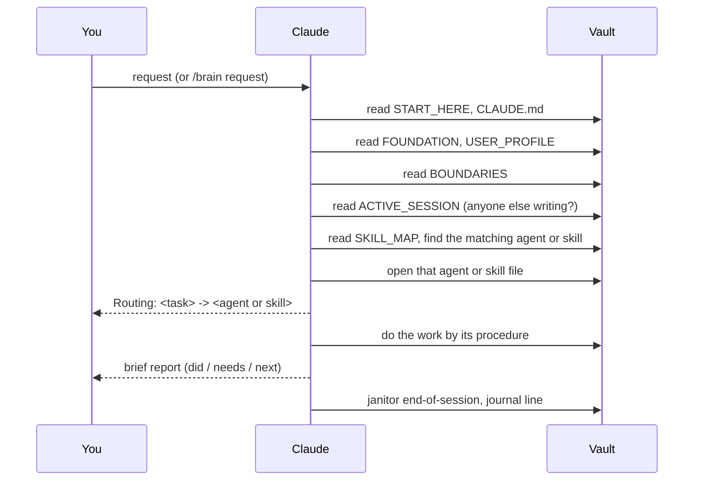
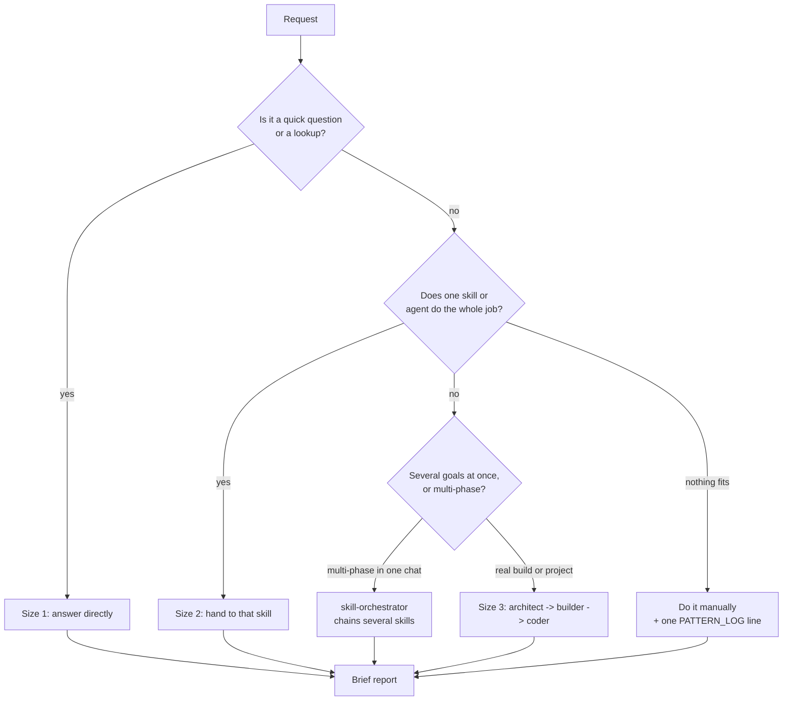
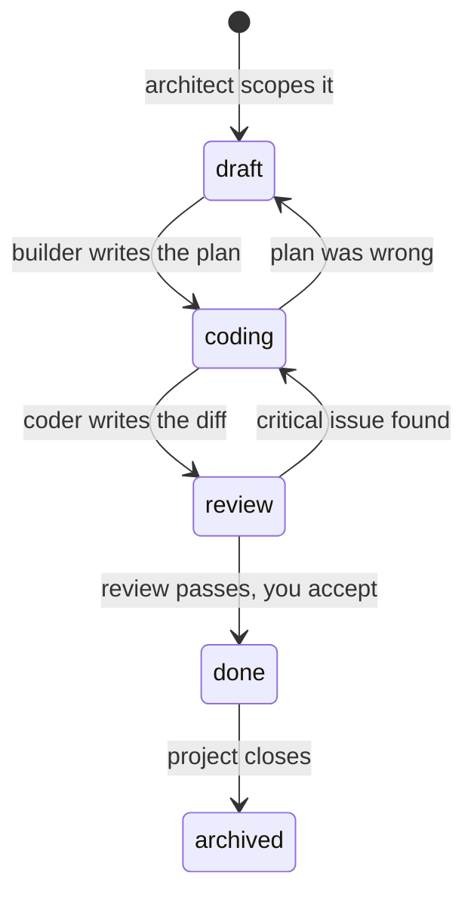
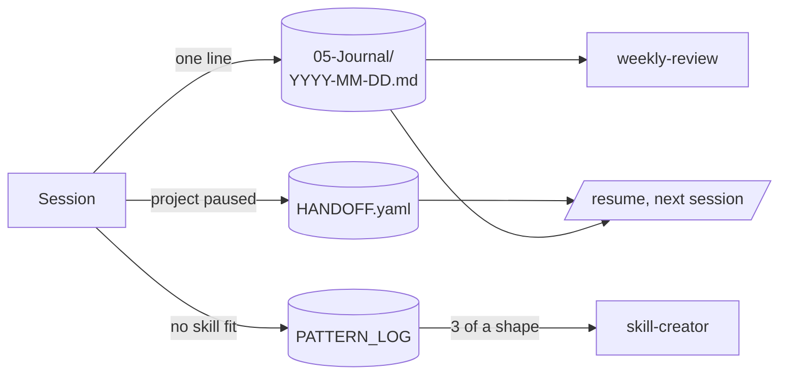
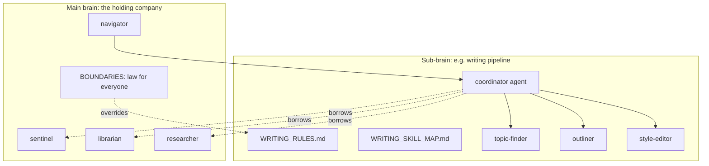

# Concepts

How the brain is put together, in the order you need it. Every diagram here renders on GitHub and in Obsidian.

## 1. The big idea

Claude is capable but forgetful and inconsistent: every new chat starts from nothing, and the same request can be handled three different ways on three different days. This system fixes both with files, not software.

- **Memory** is Markdown in folders that Claude reads at the start of each session.
- **Consistency** comes from written procedures (agents and skills) that Claude opens and follows instead of improvising.
- **Safety** comes from a boundaries file that wins over any request.
- **Improvement** comes from logging what did not fit and turning repeats into new procedures.

## 2. Four layers and a loop

| Layer | Question it answers | Key file |
|---|---|---|
| 1. Inner self | Who is asking and how do they want it? | `99-Meta/USER_PROFILE.md` |
| 2. Mapping | Where does this go and who handles it? | `99-Meta/SKILL_MAP.md` |
| 3. Tools | How exactly is the work done? | `99-Meta/agents/*.md`, `99-Meta/skills/**/*.md` |
| 4. Interface | How did the request arrive? | `.claude/commands/`, the boot prompt |
| Loop | Is everything still healthy and safe? | `agents/janitor.md`, `agents/sentinel.md` |

The foundation sits under all of it: `FOUNDATION.md` (how the system works) and `BOUNDARIES.md` (what it must never do). Only you edit those two.

## 3. The boot sequence

Every session reads the same files in the same order before doing anything:

If FOUNDATION or USER_PROFILE cannot be read, Claude stops and says so instead of guessing.

## 4. Routing and the three sizes of work

The navigator never does the work. It decides how big the request is and who should handle it.

The routing line (`Routing: <task> -> <destination>`) is printed first so you can check the session followed the system without reading the whole answer.

## 5. Agents versus skills

| | Agent | Skill |
|---|---|---|
| What it is | A standing role with one job | A procedure for one kind of task |
| Has a model tier | Yes (`model:` in frontmatter) | No, runs on whatever is active |
| Lives in | `99-Meta/agents/` | `99-Meta/skills/<group>/` or `skills/<name>/` |
| Example | `janitor` owns hygiene across sessions | `capture` drops one note into the Inbox |
| Created by | skill-creator, when a role keeps recurring | skill-creator, when a task repeats three times |

Both use the same file shape: frontmatter (`name`, `trigger`, `inputs`, `outputs`, `depends_on`), then Purpose, When to use, When NOT to use, Procedure, Style rules, Example. The "When NOT to use" section is as important as the procedure; it is what stops two skills fighting over the same request.

## 6. The ticket pipeline

For real build work, thinking and typing are separated across three agents so the expensive part never runs on a vague plan.

The ticket is a YAML file (`01-Projects/<project>/tickets/TICK-NNN.yaml`) that carries all state. Any session, any model, any person can pick up a ticket without the chat that created it. The architect also stamps a suggested model per stage from `MODEL_SELECTOR.md`.

## 7. Model tiers

| Tier | Used for | Default agents |
|---|---|---|
| fast | Routing, scoping, mechanical work with a clear spec | navigator, architect, coder, janitor, librarian, sentinel |
| careful | Ambiguity, research, judgment, noticing its own uncertainty | builder, researcher, skill-creator, capability-auditor, deck-builder |
| high | Real data, money, irreversible actions | any ticket flagged high-stakes |

Decision rule, first match wins: high stakes, then genuinely ambiguous, then well specced, then pure routing. Map the tier names to the models on your plan in `MODEL_SELECTOR.md`. On a single-model plan the rule still tells you where to slow down.

## 8. Memory: journal, pattern log, handoff

- The journal is what happened, one honest line per session.
- The pattern log counts what did not fit. It is the sensor for self-improvement.
- `HANDOFF.yaml` (from the `project-handoff` skill) is where a project stopped: state, next steps, key files, errors already solved.

## 9. The always-on loop

| Agent | When | Does |
|---|---|---|
| janitor | End of every session; weekly; `/janitor` | Broken links, notes without frontmatter, inbox older than 7 days, maps out of date |
| librarian | The moment anything new is created | Tags it, indexes it, proposes links |
| reaper | Weekly | Archives stale notes; after 30 days in Archives, lists them for deletion; you can veto |
| sentinel | Before anything leaves the machine | Blocks secrets and ID numbers, quarantines to `_local-only/` |
| git-sync | Daily, if set up | Sentinel-gated backup to your private repo |

The janitor never batch-fixes more than 20 issues; it reports and waits.

## 10. Sub-brains

When one project becomes a repeatable multi-step pipeline with several specialist roles and its own rules, it can become a sub-brain: one coordinator agent, a project-scoped skill map, a numbered rules file, and specialists registered in the main maps.

Test before creating one: repeatable pipeline, several distinct roles, its own rules and data. All three, or keep it flat. Full pattern: `99-Meta/SUB_BRAIN_PATTERN.md`.

## 11. Several assistants, one vault

If you let more than one AI tool write to the folder (Claude plus another assistant, or two Claude sessions), `ACTIVE_SESSION.md` is an advisory lock: whoever is writing adds a line, everyone else reads only. `AGENTS.md` gives non-Claude tools the same boot rules.

## 12. Glossary

| Term | Meaning |
|---|---|
| Vault | The folder. Obsidian's word for it. |
| Hub | `_hub.md`, the index note of a project: goal, status, key files, assigned agents and skills, decisions |
| Routing line | First line of a substantive reply naming who handled it |
| Brief format | Per-task status block: did, needs, next |
| Sentinel pass | The scan that must be clean before anything leaves the machine |
| Proposed | A draft skill or agent waiting for your approval |
| Portable skill | A skill in `skills/` that also works installed in Claude's own skill store |
