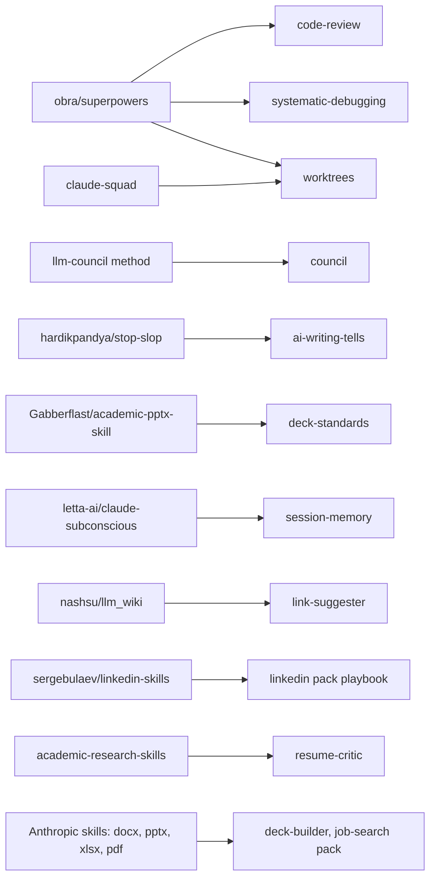

# Credits: skills and repositories this builds on

The brain borrowed ideas from several open projects. Most were rebuilt as native vault skills rather than installed, so they follow the same boundaries and one-job rule. This page lists each source, what was taken, and the decision made.

## Adopted as native skills

| Source | What was taken | Became |
|---|---|---|
| [obra/superpowers](https://github.com/obra/superpowers) | Requesting and receiving code review; systematic debugging; git worktrees for isolation | `code-review`, `systematic-debugging`, `worktrees` (rebuilt, trace-not-run rule added) |
| claude-squad | One isolated workspace per task | Part of `worktrees` |
| llm-council method (Andrej Karpathy, popularised by Ole Lehmann), via aiwithremy/claude-skills-llm-council | Several independent advisors, peer review, a chairman synthesis | `council` |
| [hardikpandya/stop-slop](https://github.com/hardikpandya/stop-slop) | A de-slop pass for AI writing tells | `03-Resources/ai-writing-tells.md`, used by professional-writing and research-documentation |
| [Gabberflast/academic-pptx-skill](https://github.com/Gabberflast/academic-pptx-skill) (MIT) | Communication-first slide rules, action titles, ghost-deck test | `deck-standards`, generalised to academic, professional and trading registers |
| [letta-ai/claude-subconscious](https://github.com/letta-ai/claude-subconscious) | Memory architecture ideas | `session-memory`, trimmed and kept local (no cloud transcripts) |
| [nashsu/llm_wiki](https://github.com/nashsu/llm_wiki) | Graph ideas for related-note suggestions | `code/link-suggester/` |
| sergebulaev/linkedin-skills (MIT) | Nine-component LinkedIn profile playbook | linkedin pack |
| academic-research-skills | Reviewer agents that are read-only and run in a fresh context; score-trajectory reporting | `resume-critic` in the job-search pack |
| Morgan Housel, *The Psychology of Money* (book) | Behavioural patterns in money decisions | `tilt-guard` in the trading pack |

## Wired in as tools

| Source | Use |
|---|---|
| [haris-musa/excel-mcp-server](https://github.com/haris-musa/excel-mcp-server) | Read and write .xlsx from Claude Code (`.mcp.json` in the original vault) |
| Anthropic's document skills (docx, pptx, xlsx, pdf) | File output for decks, resumes and spreadsheets |
| Tesseract OCR | Scanned PDF comparison tool in the original vault |

## Evaluated and deliberately not installed

| Source | Decision and reason |
|---|---|
| [thedotmack/claude-mem](https://github.com/thedotmack/claude-mem) | Not installed: privacy first. Replaced by the local `session-memory` skill |
| microsoft/playwright-mcp, lackeyjb/playwright-skill, vercel-labs/agent-browser | Skipped: duplicate Claude in Chrome |
| affaan-m/ecc (large agent and skill kit) | Ideas mined, never bulk-installed; conflicts with one-job-per-file |
| nextlevelbuilder/ui-ux-pro-max-skill | Reference only, for future dashboard work |
| NousResearch/hermes-agent | Always-on chat agent; gated behind the autonomous-run rules, not adopted |
| earendil-works/pi | Multi-model terminal agent; optional, not part of the template |
| ogulcancelik/herdr | Agent terminal multiplexer used by the original maestro and lanes; not required by the template |

## Discovery lists

- [hesreallyhim/awesome-claude-code](https://github.com/hesreallyhim/awesome-claude-code), a curated list used to find most of the above.

## The rule for borrowing

Read the idea, rebuild it as a vault skill with a "when NOT to use" section, keep BOUNDARIES in force, and credit the source here. Bulk-installing large kits is avoided on purpose: it floods the skill map with overlapping triggers.

If you maintain one of these projects and want the description corrected, open an issue.
