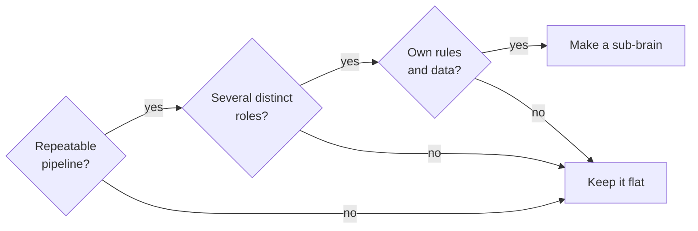

# Customising

The brain is meant to become yours. This page covers adding skills and agents, building a sub-brain, mapping models, using other AI tools, and what not to change.

## What to change and what to leave alone

| Change freely | Change with care | Leave alone |
|---|---|---|
| USER_PROFILE (it is you) | SKILL_MAP rows (keep it in sync with the files) | The universal section of BOUNDARIES |
| Owner-specific BOUNDARIES rules | Agent procedures (keep "When NOT to use") | The routing-line rule in CLAUDE.md |
| Templates in `99-Meta/templates/` | MODEL_SELECTOR tiers and mapping | Sentinel's core patterns (add, do not remove) |
| Adding skills, agents, commands | VAULT_MAP routing rules | The "drafts only" rule |

## Add a skill

Fastest: ask skill-creator.

```text
Make me a skill for <task>. Here are two examples of it done well: <paste>.
It should never <constraint>.
```

It drafts into `99-Meta/skills/proposed/<name>.md`. Read it, edit, then say "promote <name>".

By hand:

1. Create `99-Meta/skills/<group>/<name>.md`:

```markdown
---
name: meeting-minutes
trigger: the owner pastes meeting notes or a transcript and wants actions
inputs: raw notes or transcript, the project hub if named
outputs: a minutes note in the project folder, action list with owners
depends_on: brief
---

# Meeting Minutes

## Purpose
Turns raw meeting notes into decisions, actions with owners, and open questions,
filed in the right project, so nothing agreed in a meeting gets lost.

## When to use
- Notes or a transcript are pasted with "minutes", "actions", "what did we agree".

## When NOT to use
- A single action item. Use capture.
- Anything that would send the minutes to attendees. Drafts only.

## Procedure
1. Identify the project; ask once if unclear.
2. Extract decisions, actions (owner, due date only if stated), open questions.
3. Never invent an owner or a date. Mark "unassigned" or "no date".
4. Write `01-Projects/<project>/minutes/YYYY-MM-DD-<slug>.md`.
5. Add open actions to the hub's Open threads.
6. Report in brief format.

## Style rules
- Owner's names for people, not full names unless given.
- No em dashes.

## Example
...
```

2. Add a row to `99-Meta/SKILL_MAP.md` (right group) and `99-Meta/SKILL_INDEX.md` (right tag).
3. Optional: a command in `.claude/commands/minutes.md` that points at the file.

Rules of thumb: one job per skill; the "When NOT to use" list names the neighbouring skill to use instead; procedures are numbered steps an unfamiliar session could follow.

## Add an agent

Make an agent only when a role is persistent: it owns a job across sessions, runs on a schedule, or coordinates other skills. Otherwise make a skill.

An agent file is a skill file plus a `model:` line and usually "Hard limits". Register it in `SKILL_MAP.md`, `SKILL_INDEX.md` and the roster in `MODEL_SELECTOR.md`.

## Build a sub-brain

When one project runs a repeatable multi-step pipeline with several distinct roles and its own rules, it can earn a sub-brain.



Steps:
1. Name one coordinator agent (existing or new).
2. Write `01-Projects/<p>/<P>_RULES.md` (numbered rules) and `<P>_SKILL_MAP.md` (the main map at project scope).
3. Build only the specialists the pipeline needs, in the main skill folders, registered under a project heading in SKILL_MAP.
4. Borrow main agents (researcher, sentinel, librarian); never re-implement them.
5. Link the rules and map from the project hub.

Good candidates: a writing and publishing pipeline, client onboarding, hiring, a job search, a trading book, grant applications.

## Map model tiers

Agent files say `sonnet`, `fable` or `opus` in their `model:` line. Treat these as tier names:

| Tier name | Meaning | Put here |
|---|---|---|
| sonnet | fast default | your everyday model |
| fable | careful judgment | your strongest reasoning model |
| opus | high stakes | your strongest model, used sparingly |

Edit the "Map it to" column in `99-Meta/MODEL_SELECTOR.md`. When you compare two models on a real task, add a row to the evidence log; that is how the defaults stay honest.

## Use other AI tools with the same vault

`AGENTS.md` gives any assistant (Codex, Cursor, ChatGPT with folder access) the same boot and routing rules. If two tools can write at once:

1. Keep `ACTIVE_SESSION.md` as the advisory lock.
2. Agree a default split, for example "the other tool drafts in 00-Inbox; Claude owns 99-Meta".
3. Nobody edits FOUNDATION or BOUNDARIES without you.

## Install portable skills into Claude itself

Each folder in `skills/` is a complete Claude skill. To use one outside the vault, copy the folder, rename `<name>.md` to `SKILL.md`, and add it through Claude's skill settings or your Claude Code skills directory. The vault copy stays the master; update both when you edit.

## Change the folder structure

Do not add or rename top-level folders casually; many procedures refer to them. If the structure feels wrong, write a proposed change to FOUNDATION section 2 and VAULT_MAP, then apply it in one pass with the janitor checking links afterwards.
