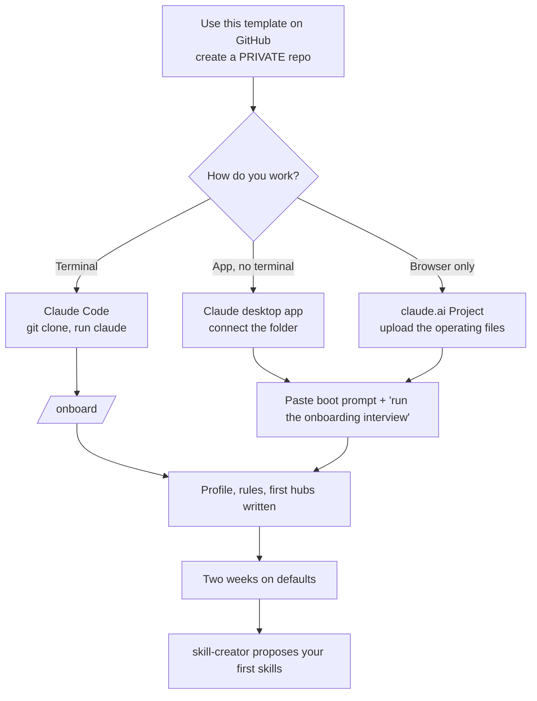

# Getting started

This page takes you from zero to a working brain that knows who you are. Pick the path that matches how you like to work. All three end at the same place: the onboarding interview.



## Before you start

- A Claude account. Any paid plan works; Claude Code needs a plan or API access that includes it.
- 30 to 45 minutes for the interview, or three 15-minute sittings.
- Optional: [Obsidian](https://obsidian.md) to browse the vault with backlinks and a graph view. It is free and reads the folder as-is.
- Optional: Git, if you want versioned private backups.

## Step 1. Make your own private copy

1. On this repository's GitHub page, click **Use this template**, then **Create a new repository**.
2. Name it (for example `my-brain`) and choose **Private**. Your vault will hold personal and possibly confidential material.
3. If you do not want GitHub at all, click **Code**, then **Download ZIP**, and unzip it anywhere you like, for example `Documents/my-brain`.

## Step 2, path A. Claude Code (terminal)

```bash
git clone https://github.com/<you>/my-brain.git
cd my-brain
claude
```

Claude Code reads `CLAUDE.md` automatically, so the routing rule is active from the first message. The slash commands in `.claude/commands/` appear when you type `/`.

Claude Code runs a start-up hook that notices a fresh vault, so the brain greets you and offers the interview by itself. You can also type:

```text
/onboard
```

Tips:
- Use `/brain <task>` whenever you want to be certain the full boot sequence ran first.
- Run `claude` from the vault root so relative paths in the agent files resolve.

## Step 2, path B. Claude desktop app

1. Open the Claude desktop app and start a new conversation.
2. Connect your vault folder to the conversation (add a folder from the attachment or "+" menu).
3. Paste the boot prompt:

```text
This is my second-brain vault. Read 99-Meta/START_HERE.md in full, then FOUNDATION,
USER_PROFILE, BOUNDARIES and ACTIVE_SESSION. Route every request through
99-Meta/SKILL_MAP.md and open the actual agent or skill file before acting.
State routing as the first line. Obey BOUNDARIES. Report in brief format.
Task: run the onboarding interview.
```

Save the boot prompt somewhere you can paste it quickly (a text snippet, a pinned note). Start every new conversation with it plus your task.

## Step 2, path C. claude.ai in a browser

claude.ai cannot write to a folder on your disk, so this path is best for trying the system or for read-mostly use.

1. Create a new Project.
2. Upload `CLAUDE.md`, everything in `99-Meta/` (including `agents/` and `skills/`), and the `skills/` folder files you care about.
3. Paste the boot prompt above into the Project instructions, without the "Task:" line.
4. Start a chat: "Run the onboarding interview."
5. Claude will give you the finished files as text. Paste them back into your local copy, or re-upload them to the Project.

## Step 3. The onboarding interview

On a fresh vault the brain starts this by itself. Pick quick (15 minutes), standard (45) or deep (a few sittings). It asks one question at a time with suggested answers, saves progress after every answer, and shows the exact lines before writing. You can answer in a word, paste text, or say "skip" or "stop for today". The table below is the standard mode; deep mode adds how you think and decide, working style, feedback, writing voice, people, goals, growth and a role pack.

| Block | About | Goes into |
|---|---|---|
| 1 | Who you are, your role, your week | USER_PROFILE |
| 2 | How you want it to talk to you | USER_PROFILE |
| 3 | Your domains and where your reference material lives | USER_PROFILE, 02-Areas |
| 4 | Your hard rules and confidentiality | BOUNDARIES, owner section |
| 5 | Current projects (five at most) | 01-Projects/*/_hub.md |
| 6 | What you do every week that repeats | Journal, PATTERN_LOG seeds |
| 7 | Devices, apps, AI tools, backups | USER_PROFILE |
| 8 | Daily and weekly check-ins | USER_PROFILE |
| 9 | One first win for this week | Journal, done next |

Every question: [onboarding-interview.md](onboarding-interview.md).

## Step 4. Your first week

| Day | Do this | Takes |
|---|---|---|
| Every morning | `/daily` (or "start today's journal") | 1 min |
| Any time | `/capture <thought>` for anything you do not want to lose | seconds |
| Every evening | `/inbox` and approve where each item goes | 5 min |
| Once | The first-win task from Block 9 | varies |
| End of week | `/weekly` | 10 min |

What good looks like after week one: an empty inbox, five or so journal entries, at least one project hub with real content, and the routing line on every substantive reply.

## Step 5. Let it learn you (week two onward)

Every time Claude handles something that no skill covers, it adds one line to `99-Meta/PATTERN_LOG.md`. When the same shape appears three times, skill-creator drafts a skill into `99-Meta/skills/proposed/`. You read it, edit it, and approve or reject it. Approved skills get a row in `SKILL_MAP.md` and the navigator starts using them.

You can also just ask: "make me a skill for turning meeting notes into action lists."

## Step 6. Back it up (optional)

If your copy is a private GitHub repo, the `git-sync` agent can back it up daily, always after a sentinel scan. Ask "set up daily backup". It will explain what it needs (a credential in your system's git credential store, never in a note) and will not push anything that fails the scan.

## Checklist

- [ ] Private copy created
- [ ] Opened in Claude Code, the desktop app, or a claude.ai Project
- [ ] Onboarding interview done, profile has no `{{placeholders}}`
- [ ] Owner-specific rules approved in BOUNDARIES
- [ ] First project hubs created
- [ ] First `/daily` and `/inbox`
- [ ] Boot prompt saved somewhere handy (desktop app and claude.ai paths)

Next: [concepts.md](concepts.md) explains how the pieces fit together.
