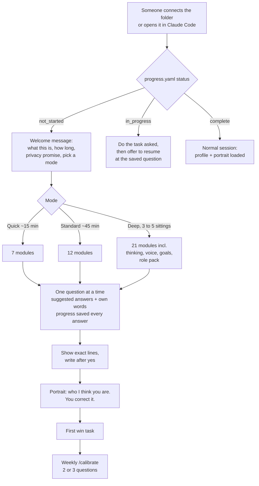

# Onboarding interview

The first time anyone connects a fresh copy of this vault, the brain interviews them before it does any work. It asks one question at a time, offers suggested answers, saves progress after every answer, and can take as long as the person likes across as many sittings as they want. At the end it writes a one-page portrait of how they work and asks them to correct it. After that, short weekly tuning keeps the profile true.

Everything here is driven by one file, [`99-Meta/onboarding/questions.yaml`](../99-Meta/onboarding/questions.yaml): 21 modules, 75 questions and 30 role-specific questions. To change the interview for everyone, edit that file. No procedure changes needed.

## How it starts



| Surface | How the first run is triggered |
|---|---|
| Claude Code | Automatically. A SessionStart hook in `.claude/settings.json` runs `code/onboarding/first_run_check.py`, which tells Claude this is a first run |
| Claude desktop app, claude.ai, other assistants | `CLAUDE.md`, `AGENTS.md` and `START_HERE.md` all tell Claude to read `progress.yaml` first and greet a new owner. Pasting the boot prompt is enough |
| Any time | `/onboard`, or "run the onboarding interview" |

## The welcome

The exact opening lives in [`99-Meta/onboarding/welcome.md`](../99-Meta/onboarding/welcome.md). In short: the brain says it knows nothing yet, explains it will ask one question at a time with suggestions, that you can skip or stop anytime, that nothing is saved without your yes, and that it will not ask about health, religion, politics, finances or ID numbers. Then it asks how much time you have.

## Three depths

| Mode | Time | Covers | Best for |
|---|---|---|---|
| Quick | about 15 minutes | Who you are, how to talk to you, hard rules, projects, first win, portrait | Trying it out |
| Standard | about 45 minutes, 1 or 2 sittings | Quick plus your week, domains, recurring work, tools, check-ins | Most people |
| Deep | 90 to 150 minutes over 3 to 5 sittings | Standard plus how you think and decide, working style, feedback, writing voice, people, goals, growth, small preferences, a role pack | Anyone who will use it daily; the brain becomes noticeably more "you" |

You can start Quick and go deeper later: `/onboard deep` picks up the modules you have not done.

## What it feels like

```text
Claude: First one. What should I call you?
        1. First name   2. Full name   3. A nickname   4. A title, e.g. Sir or Ma'am
        ...or tell me in your own words.
You:    Ravi is fine
Claude: Got it. What do you do, in the words you'd use on a business card?
You:    I run a small design studio
Claude: And what does that mean day to day?                 <- follow-up, only if short
You:    client calls, managing four designers, writing proposals
...
Claude: So far: call you Ravi, you run the studio, short answers,
        recommendation first, nothing sent without you. Anything off?
...
Claude: I'll write the same update two ways. Which sounds right?   <- calibration exercise
        A) "Shortlist done: 3 tools. Need your pick by Friday."
        B) "I've finished the shortlist. Three tools made it through; details
            below. Could you pick one by Friday so we can start the pilot?"
You:    A, but say please
...
Claude: I'll add this to USER_PROFILE, section Communication:
          - Short, recommendation first, bullets
          - Terse but polite ("please" in requests)
        OK to save?
You:    yes
```

The (fictional) person above is shown to make the flow concrete. Where a picker tool is available, the suggestions appear as clickable options with an "Other" box; in plain chat they are numbered.

## The rules Claude follows while interviewing

1. One question at a time. Never a wall of questions.
2. Suggestions on most questions; your own words always welcome.
3. A follow-up only when an answer is short or vague, and only once.
4. Every four or five answers, a two-line reflection: "So far... Anything off?"
5. Nothing written until you see the exact lines and say yes. Your hard rules need an explicit yes because BOUNDARIES is yours alone.
6. Progress saved after every answer in `99-Meta/onboarding/progress.yaml`. Stop anytime; next session it offers to continue where you left off.
7. Skipped questions come back once, gently, in a later weekly tune-up.
8. Privacy: never asks about health, religion, politics, sexuality, ethnicity or caste, immigration status, personal finances, ID or account numbers, passwords, or family matters beyond scheduling. If you mention one, it says it won't be stored and moves on.
9. No labels. It never decides you are "an introvert" or "type A". It records what you said about yourself, in your words.

## Calibration exercises

Some answers are easier to show than to describe, so the interview includes three exercises:

| Exercise | What happens | What it learns |
|---|---|---|
| Tone A/B | The same short update written two ways; you pick and tweak | Length, warmth, directness |
| Voice A/B | From two or three pieces you paste, one paragraph in two versions of your voice | Sentence length, openers, formality, words you use and never use (saved to `02-Areas/writing/voice.md`) |
| Portrait | A one-page "how I work with you", written only from your answers | Everything; people correct a portrait far more easily than they answer abstract questions |

## The portrait

At the end, the brain fills [`portrait-template.md`](../99-Meta/onboarding/portrait-template.md) and asks "What's wrong, missing or overstated?" The corrected version is saved as `99-Meta/onboarding/portrait.md` and read at the start of every session alongside the profile. Sections: in one paragraph, talk to me like this, how I decide, how I work, never, what I'm working on, what you can take off my plate, things I'm still learning about you. See it anytime with `/portrait`.

## After onboarding: calibrate

`/calibrate` (and the end of `/weekly`, if you agreed) asks at most three questions, each based on something that happened: a correction you made three times, a mismatch between your profile and what you actually ask for, a question you skipped. Every change is shown as a diff first. This is how the brain keeps learning the person over months without a second long interview.

## Where answers go

| Module | File |
|---|---|
| Who you are, your week, communication, domains, tools, check-ins, thinking, working style, feedback, people (roles), goals, growth | `99-Meta/USER_PROFILE.md` |
| Hard rules | `99-Meta/BOUNDARIES.md`, owner section, with your explicit yes |
| Projects | `01-Projects/<name>/_hub.md` |
| Recurring work | Today's journal and `99-Meta/PATTERN_LOG.md` (seeds for your first learned skills) |
| Writing voice | `02-Areas/writing/voice.md` |
| Portrait | `99-Meta/onboarding/portrait.md` |
| Progress | `99-Meta/onboarding/progress.yaml` |

## Making it scale

- Add a module: append it to `questions.yaml` with an `id`, `title`, `writes_to` and `questions`, then add its id to the modes that should include it.
- Add a role pack: add a key under `role_pack.packs` with four or five questions. The deep mode picks it automatically for matching roles.
- Translate: the welcome language question switches the interview language; Claude rephrases questions while keeping their meaning. For a fully translated bank, copy `questions.yaml` and translate the `ask` and `suggestions` fields.
- Organisations: a firm can ship its own copy of the template with a role pack and confidentiality rules pre-filled, so every new joiner's brain starts aligned.

## Setting it up for someone else

Interview the owner, not the helper. Their words go into their profile, on their own copy, account and machine. For professionals with clients, the hard-rules module offers the confidentiality block from [safety.md](safety.md).

## Every question

The tables below are generated from `questions.yaml`.

### Getting started (`welcome`)

Modes: quick, standard, deep. Writes to: `99-Meta/onboarding/progress.yaml`.

| # | Question | Suggested answers |
|---|---|---|
| 1 | How much time do you want to give this today? You can stop at any point and pick up later, nothing is lost. | Quick, about 15 minutes / Standard, about 45 minutes / Deep, over a few sittings (best results) / Just ask me a few and see |
| 2 | How do you like to answer? | Give me options to pick from / Let me type freely / Mix of both / I'll paste or dictate long answers |
| 3 | Which language should we do this in? | English / Hindi / Hinglish / Another language |

### Who you are (`identity`)

Modes: quick, standard, deep. Writes to: `99-Meta/USER_PROFILE.md#who`.

| # | Question | Suggested answers |
|---|---|---|
| 1 | What should I call you? | First name / Full name / A nickname / A title, e.g. Sir or Ma'am |
| 2 | What do you do, in the words you'd use on a business card? | your own words |
| 3 | Where do you do it, and roughly how big is the team or organisation? | On my own / Small team, under 20 / Mid-size, 20 to 500 / Large organisation |
| 4 | Where are you based, and which time zone should I use? | your own words |
| 5 | If a colleague introduced you in one sentence, what would they say? (optional) | your own words |

### Your role and your week (`role_week`)

Modes: standard, deep. Writes to: `99-Meta/USER_PROFILE.md#who`.

| # | Question | Suggested answers |
|---|---|---|
| 1 | Walk me through a normal week. What happens on which days? | your own words |
| 2 | What do you do yourself, and what do you oversee through others? | your own words |
| 3 | Who do you answer to, and who answers to you? Roles are enough, no names needed. | your own words |
| 4 | Where does your time go that you wish it didn't? | Email / Meetings / Reports and documents / Chasing people / Searching for information |

### How you want me to talk to you (`communication`)

Modes: quick, standard, deep. Writes to: `99-Meta/USER_PROFILE.md#communication`.

| # | Question | Suggested answers |
|---|---|---|
| 1 | When I answer, how long should it be? | As short as possible / Short, with detail if I ask / Medium, with reasoning / Depends on the topic |
| 2 | Answer first and reasoning after, or the other way round? | Answer first / Reasoning first / Just the answer |
| 3 | How do you like information laid out? | Bullet points / Short paragraphs / Tables where possible / Whatever fits |
| 4 | After I finish a piece of work, how should I report back? | A short status block: done, needs me, next / A short paragraph / Only tell me what needs me / Full detail |
| 5 | Anything in AI writing that annoys you? | Long preambles / Em dashes / Emoji / Buzzwords like 'leverage' or 'delve' |
| 6 | Which spelling and register? | Indian English / British English / American English / Formal / Conversational |
| 7 | When I'm unsure about something, what should I do? | Ask me / Make your best call and flag it / Ask only for important things / Give me options |
| 8 | I'll write the same short update two ways. Which one sounds right to you? | calibration exercise |

### What you work on (`domains`)

Modes: standard, deep. Writes to: `99-Meta/USER_PROFILE.md#domains`.

| # | Question | Suggested answers |
|---|---|---|
| 1 | Which areas do you work in? For each one, are you the expert, the decision-maker, or the reviewer? | your own words |
| 2 | Where would help save you the most time? | Thinking things through / First drafts / Research / Tracking and follow-ups / Reviewing others' work |
| 3 | In your main area, how much should I explain versus assume you know? | Assume expert, skip basics / Brief refreshers are fine / Explain fully, I'm still learning it |
| 4 | What reference material do you keep going back to, and where does it live? | your own words |

### Your hard rules (`rules`)

Modes: quick, standard, deep. Writes to: `99-Meta/BOUNDARIES.md#owner-specific`.

| # | Question | Suggested answers |
|---|---|---|
| 1 | What must I never do, no matter who asks? | Never send anything without me / Never name clients / Never quote prices or fees / Never commit me to a date |
| 2 | Is any information confidential by contract or by profession? | Client details / Financial figures / HR or people matters / Internal strategy / Nothing special |
| 3 | Should client or customer names be replaced with codes in notes? | Yes, always use codes / Names are fine / Only for some clients |
| 4 | Which places am I allowed to use for work material? | This vault only / Company drive or email too / Anything I connect / Ask me each time |
| 5 | Are there professional or regulatory codes your drafts must respect? (optional) | your own words |

### Current projects (`projects`)

Modes: quick, standard, deep. Writes to: `01-Projects/<slug>/_hub.md`.

| # | Question | Suggested answers |
|---|---|---|
| 1 | What's one thing you're working on right now that has an end point? | your own words |
| 2 | What does "done" look like for it? | your own words |
| 3 | Is there a real deadline? | Yes, a fixed date / A rough target / No deadline |
| 4 | Who else is involved, by role? | your own words |
| 5 | What's the very next step? | your own words |
| 6 | Another project? | Yes / That's enough for now |

### What repeats (`recurring`)

Modes: standard, deep. Writes to: `05-Journal/<today>.md and 99-Meta/PATTERN_LOG.md (shape seed)`.

| # | Question | Suggested answers |
|---|---|---|
| 1 | What do you do every week that follows roughly the same steps? | Meeting prep or notes / Status reports / Answering the same kinds of questions / Reviewing documents / Writing posts or articles |
| 2 | What do you hand to others that comes back wrong in the same way? (optional) | your own words |
| 3 | What do you check first thing each morning? | your own words |

### Your tools (`tools`)

Modes: standard, deep. Writes to: `99-Meta/USER_PROFILE.md#ai`.

| # | Question | Suggested answers |
|---|---|---|
| 1 | Which devices do you work on? | Laptop / Desktop / Tablet / Phone |
| 2 | Which apps run your day? | Outlook or Gmail / Teams or Slack / Excel, Word, PowerPoint / WhatsApp / A practice or CRM tool |
| 3 | Where will you talk to me most? | Claude desktop app / Browser / Phone app / Claude Code in a terminal |
| 4 | Do you use other AI tools? For what? (optional) | your own words |
| 5 | Where should this vault be backed up? | Private GitHub repo / Company-approved drive / This computer only / Not sure, advise me |

### How I should check in (`rhythm`)

Modes: standard, deep. Writes to: `99-Meta/USER_PROFILE.md#preferences`.

| # | Question | Suggested answers |
|---|---|---|
| 1 | Do you want a daily journal started for you? | Yes, mornings / Yes, evenings / No |
| 2 | When should we do a weekly review? | Friday afternoon / Sunday evening / Monday morning / Skip it |
| 3 | When I notice you doing something repeatedly, should I offer to make a skill for it? | Yes, offer right away / Batch them weekly / Only when I ask |
| 4 | Can I ask you two or three short tuning questions each week, to keep learning how you work? | Yes / Once a month / No |

### How you think and decide (`thinking`)

Modes: deep. Writes to: `99-Meta/USER_PROFILE.md#thinking`.

| # | Question | Suggested answers |
|---|---|---|
| 1 | When you face a decision, what do you want from me? | A recommendation / Options with trade-offs / The strongest case against my first instinct / Just the facts |
| 2 | What convinces you? | Numbers / Examples and stories / Precedent, what others did / First-principles logic |
| 3 | How cautious should I be when I suggest things? | Conservative / Balanced / Bold, I'll pull back if needed |
| 4 | Do you prefer to plan in detail first, or start and adjust? | Plan first / Rough plan, then adjust / Start and adjust |
| 5 | Tell me about a recent decision you're happy with. What made it good? (optional) | your own words |

### Your working style (`work_style`)

Modes: deep. Writes to: `99-Meta/USER_PROFILE.md#work-style`.

| # | Question | Suggested answers |
|---|---|---|
| 1 | When do you do your best focused work? | Early morning / Late morning / Afternoon / Night |
| 2 | How should I handle things that come up while you're focused? | Capture them, show me later / Tell me only if urgent / Tell me right away |
| 3 | How big should a piece of work be before I check in with you? | Small steps, check often / Medium chunks / Do the whole thing, then show me |
| 4 | How do you work with deadlines? | Early, well ahead / Steady pace / Close to the deadline / Remind me well in advance |

### Feedback and disagreement (`feedback`)

Modes: deep. Writes to: `99-Meta/USER_PROFILE.md#communication`.

| # | Question | Suggested answers |
|---|---|---|
| 1 | If I think you're making a mistake, how should I say it? | Bluntly / Directly but politely / Ask a question that makes me see it / Only if it really matters |
| 2 | When I review your work, what do you want? | Only the top three fixes / Everything I find / Mark it up as a diff / Rewrite it, then show me |
| 3 | When I get something wrong about you, how should I learn from it? | Update the profile and tell me / Update silently / Ask before changing anything |

### Your writing voice (`voice`)

Modes: deep. Writes to: `02-Areas/writing/voice.md`.

| # | Question | Suggested answers |
|---|---|---|
| 1 | Paste two or three things you wrote that you're happy with: emails, posts, a report section. | your own words |
| 2 | Who do you write for most? | Clients / Senior leadership / My team / The public, posts and articles |
| 3 | Here are two versions of the same paragraph. Which one is closer to you, and what would you change? | calibration exercise |
| 4 | How do you usually open and close emails? (optional) | your own words |

### The people around your work (`people`)

Modes: deep. Writes to: `99-Meta/USER_PROFILE.md#people (roles only)`.

| # | Question | Suggested answers |
|---|---|---|
| 1 | Which roles do you write to or deal with most? For each, how formal should I be? | Very formal / Professional / Warm and informal |
| 2 | Do you want me to know names for people I'll draft messages to? | Yes, add them as I go / Roles only / Ask each time |

### What you're aiming for (`goals`)

Modes: deep. Writes to: `99-Meta/USER_PROFILE.md#goals`.

| # | Question | Suggested answers |
|---|---|---|
| 1 | What would make the next three months a success? | your own words |
| 2 | And this year? (optional) | your own words |
| 3 | Is there anything you want to stop doing, or do less of? (optional) | your own words |

### Learning and growth (`growth`)

Modes: deep. Writes to: `99-Meta/USER_PROFILE.md#growth`.

| # | Question | Suggested answers |
|---|---|---|
| 1 | What do you want to get better at this year? | your own words |
| 2 | How do you learn best? | Examples first / Explanations first / Quiz me / Learn by doing |

### Small things that matter (`likes`)

Modes: deep. Writes to: `99-Meta/USER_PROFILE.md#preferences`.

| # | Question | Suggested answers |
|---|---|---|
| 1 | What small things irritate you in how work is done or written? (optional) | your own words |
| 2 | What does a colleague do that makes your day easier? (optional) | your own words |

### Questions for your kind of work (`role_pack`)

Modes: deep. Writes to: `99-Meta/USER_PROFILE.md#domains`.

Claude picks the pack closest to your role, or asks which fits.

| Pack | Questions |
|---|---|
| manager partner | How many people report to you directly, and how do you track what they're doing?<br>Which meetings do you prepare for, and what does good preparation look like?<br>What decisions come to you every week?<br>How do you want delegated work tracked: a list, reminders, or a weekly summary? |
| consultant | How does a typical engagement start and end?<br>Which deliverables do you produce most: proposals, decks, memos, models?<br>How do you research a new client before the first meeting?<br>What does a great deliverable from your firm look like? |
| tax legal compliance | Which regimes, laws or areas do you cover?<br>Where do new circulars, rulings or notifications come from, and how do you track them?<br>What do clients ask you most often?<br>Which parts always need your professional judgment, never a draft's? |
| writer creator | What do you publish, where, and how often?<br>Where do your ideas come from, and where do you keep them?<br>What does your editing process look like? |
| student researcher | What are you studying or researching, and what's the next deadline?<br>How do you take notes from papers and lectures?<br>What would you like to be quizzed on? |
| developer | Which languages, frameworks and repositories do you work in?<br>How do you want code changes shown: diffs, full files, or explanations?<br>Should I run tests, or give you the command to run them? |
| job seeker | Which roles, sectors and locations are you targeting?<br>Do you have a master resume, and in what format?<br>How many applications a week are you aiming for? |
| trader | Which instruments and timeframes do you trade?<br>What are your risk rules per trade and per day?<br>Do you keep a trading journal now? |
| small business | What does the business do, and who are the customers?<br>Which tasks eat your week: sales, suppliers, accounts, hiring?<br>Which numbers do you check every week? |

### Your first win (`first_win`)

Modes: quick, standard, deep. Writes to: `05-Journal/<today>.md`.

| # | Question | Suggested answers |
|---|---|---|
| 1 | What's one task this week where, if I did it well, you'd keep using this? | Draft something I've been putting off / Organise my notes or inbox / Research a question / Plan a project |
| 2 | Shall we do it right now? | Yes, let's do it / Later today / Tomorrow |

### Here's who I think you are (`portrait`)

Modes: quick, standard, deep. Writes to: `99-Meta/USER_PROFILE.md (all sections, with approval)`.

| # | Question | Suggested answers |
|---|---|---|
| 1 | Here's a one-page portrait of how you work, written from your answers. What's wrong, missing or overstated? | calibration exercise |
