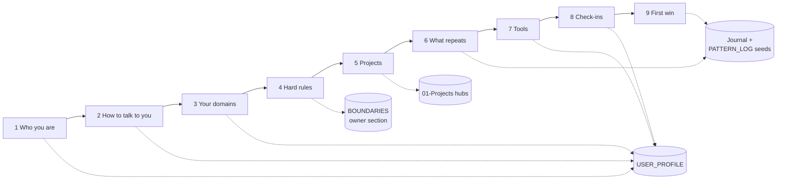

# Onboarding interview

The questions Claude asks a new owner on day one, and the file each answer lands in. The `onboard` skill (`99-Meta/skills/vault/onboard.md`) runs this; `/onboard` starts it in Claude Code.

## Ground rules Claude follows

1. It says what the interview is for and how long it takes, and offers three short sittings instead of one.
2. One block at a time. Short answers, pasted text, transcribed voice notes and "skip" are all fine.
3. After each block it shows the exact lines it will write, and to which file, and waits for your yes.
4. Unanswered questions stay blank and are asked again later. Nothing is filled with a guess.
5. It never asks for, and never writes, ID numbers, passwords, bank details or client financials.

## Block 1. Who you are

1. What is your name, and what should I call you?
2. What is your role and organisation, in the words you would put on a business card?
3. In two or three lines, what does a normal week look like?
4. Which areas are you personally responsible for, and which do you oversee through other people?
5. Who do you answer to, and who answers to you? Roles are enough.
6. Which city and time zone do you work from? Any regular travel?

## Block 2. How you want me to talk

1. Short and direct, or fuller explanations? Does it change by topic?
2. Any words, phrases or styles you dislike in AI writing? (Examples: em dashes, emoji, "delve", long preambles.)
3. Which language, and which spelling? Any drafts you want in another language?
4. Answer first and reasoning after, or the other way round?
5. After I finish work, a short status block or a paragraph?
6. When I am unsure, should I ask you, or make my best call and flag it?

## Block 3. What you work on

1. List the domains you work in. For each: are you the expert, the decision maker, or the reviewer?
2. Which take the most of your time?
3. Where do you want help most: thinking, drafting, research, tracking, or reviewing?
4. What reference material do you keep going back to, and where does it live today?

## Block 4. Your hard rules

1. What must I never do, no matter who asks?
2. Is any information confidential by contract or by profession? Which categories?
3. Can client or customer names appear in notes, or should I use codes?
4. Which regulations or professional codes govern your work that I should respect when drafting?
5. Which services am I allowed to use for work data (company drive, email, none)?
6. Anything you never want me to comment on unless asked?

## Block 5. Current projects (up to five)

For each:
1. What is it called, and what does "done" look like?
2. Is there a real deadline? ("No" is a fine answer.)
3. Who else is involved, by role?
4. Where do the files live today?
5. What is the next concrete step?

## Block 6. What repeats

1. What do you do every week that follows roughly the same steps?
2. What do you delegate that comes back wrong in the same way each time?
3. What do you write regularly? Can you share two or three good past examples so I can learn the style?
4. What do you check every morning?

## Block 7. Tools

1. Which devices do you work on?
2. Which apps run your day?
3. Which Claude surfaces will you use: desktop app, browser, phone, Claude Code?
4. Do you use other AI tools? For what?
5. Should this vault back up to a private GitHub repo, an approved company drive, or stay on this machine only?

## Block 8. Check-ins

1. Do you want a daily journal entry started for you? Morning or evening?
2. A weekly review: which day and time?
3. Should I propose new skills when I spot a repeat, or only when you ask?
4. How often should the janitor run a full sweep?

## Block 9. First win

1. What is one task this week where, if I helped well, you would keep using this?
2. I will do that task next, through the system, so you see the full loop once.

## Questions the brain keeps asking after day one

Built into the daily and weekly skills so the profile stays true without a second onboarding.

| When | Question |
|---|---|
| Every `/daily` | What is the one thing that must move today? Anything from yesterday still open? |
| Every `/weekly` | What worked? What did you do three times that I could take over? Is anything in your profile no longer true? |
| A new project appears | Is this a project (it ends) or an area (it does not)? Who else is involved? |
| skill-creator spots a repeat | I noticed you did X three times. Want a skill for it? Here is a draft. |
| Monthly `/audit` | These skills were not used this month. Keep, merge or retire? |

## Where each answer goes

| Block | File |
|---|---|
| 1, 2, 3, 7, 8 | `99-Meta/USER_PROFILE.md` |
| 4 | `99-Meta/BOUNDARIES.md`, owner-specific section only, with your explicit approval |
| 3 (reference material) | `02-Areas/<domain>/`, `03-Resources/` |
| 5 | `01-Projects/<name>/_hub.md` |
| 6, 9 | `05-Journal/<today>.md`, `99-Meta/PATTERN_LOG.md` (shape `seed`) |

A filled example for a fictional consulting partner is in [`examples/sample-owner/`](../examples/sample-owner/).
