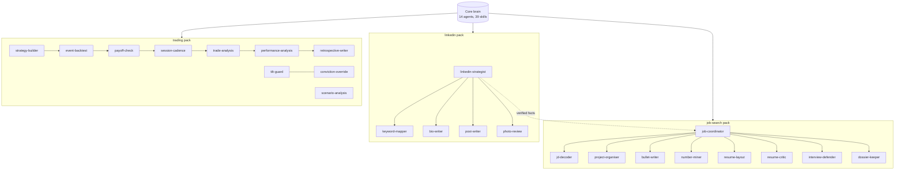

# Packs and advanced agents

The core ships 14 agents and 39 skills that every owner needs. The original private vault grew more: sub-brains for a job search, LinkedIn and a live trading book, plus a parallel-execution layer. They are included here as optional packs, generalised so they work for anyone, and explained below.

## Job-search pack

A full pipeline from job description to submitted application, where the brain drafts and you submit. It was the first sub-brain in the original vault and the one that proved the sub-brain pattern.

| Piece | Kind | Tier | What it does | How you use it |
|---|---|---|---|---|
| job-coordinator | agent | careful | Runs the pipeline and delegates every step; nothing is invented, every fact traces to your record | "Tailor my resume for this JD: <paste>" |
| dossier-keeper | agent | fast | One record per application: JD, exact resume sent, cover letter, defense sheet, status trail | "What did we send to <company>?" |
| jd-decoder | skill | | JD into a profile: role type, seniority, verbatim keywords, flags | automatic step 1 |
| project-organiser | skill | | Every project in a tagged box with buckets and lead angles | "Add this project to my bank" |
| bullet-writer | skill | | Verb + artifact + method + number; two bullets per project | automatic |
| number-miner | skill | | Digs real figures out of notebooks, CSVs and reports, with sources | "Find numbers for <project>" |
| resume-layout | skill | | Budget lines before writing; one page; no orphan lines; measure the bottom gap | automatic |
| resume-critic | skill | | Five readers (ATS, recruiter, HR, hiring manager, technical) in a fresh session, read-only, reports regressions | automatic before shipping |
| interview-defender | skill | | Follow-up questions for every bullet with honest answers; an indefensible bullet blocks shipping | "Prep me for <company>" |

Templates: RESUME_RULES (16 starter rules), ROLE_BUNDLES, CORRECTIONS, PROJECT_BANK, tracker.

What makes it different from a resume prompt: the critic runs in a fresh context so the builder cannot grade its own work; numbers are mined from artifacts, not written from memory; a separate corrections file stops known-wrong facts creeping back; and the brain never submits.

## LinkedIn pack

| Piece | Kind | What it does |
|---|---|---|
| linkedin-strategist | agent (careful) | Owns all nine profile components, keeps them in sync with verified facts, reconciles drafts from other assistants, logs every change |
| linkedin-keyword-mapper | skill | What your target-role searches look for that your profile lacks, and a "do not add" list for things that are not true |
| linkedin-bio-writer | skill | 2 to 3 headline options and an About section with the target in the first 270 characters |
| linkedin-post-writer | skill | One post, one point, a real fact up front, no hashtag stacks |
| linkedin-photo-review | skill | Written feedback on a photo; never generates or edits one |

## Trading pack

Ten skills distilled from a multi-week live trading challenge, generalised. The chain runs in trade-lifecycle order.

| Skill | Core rule |
|---|---|
| strategy-builder | No falsifier, no strategy. Size from risk (risk budget / stop distance), exits before entries |
| event-backtest | Look at how this name reacted to the same event before, and what options already price |
| payoff-check | Before any option order: P&L at your own forecast. If it loses there, the structure is inverted |
| session-cadence | Same morning table every day; the weekly sweep checks every position against the plan |
| tilt-guard | Six named behavioural patterns, each with a tell in your own words; one line, once |
| conviction-override | When a rule fires and you want to hold: halve, new floor, confirmation trigger, log both paths |
| scenario-analysis | Book impact per scenario against your drawdown ladder |
| trade-analysis | Thesis, execution and rules scored separately |
| performance-analysis | Return, risk, attribution, process versus luck |
| retrospective-writer | The period review, organised by decision type |

The pack never places orders and is analysis tooling, not investment advice.

## Advanced agents in the original vault (not shipped yet)

These exist in the original private vault and are on the [roadmap](roadmap.md). They depend on a specific terminal setup, so they need a tool-agnostic rewrite before release.

| Agent or skill | What it does | Why not shipped yet |
|---|---|---|
| maestro | Conductor: takes several goals, has architect scope them, builds one dependency graph, runs ready tickets through builder, coder and code-review in parallel (serial until proven, never more than five at once), two human gates | Built around a terminal multiplexer (Herdr) and a Windows shell setup |
| lanes | Role packets for parallel coding terminals (debug, code, test, review, deploy) and the wave shapes they run in | Same dependency |
| brain dashboard | A local HTML dashboard of projects, tickets, inbox age and skill usage | Paths and data specific to the original vault |
| task-prompt-sync (proposed) | Catches a scheduled task whose prompt names files or agents that no longer exist, and writes a correction | Still in the original's proposed queue |

## Retired capabilities

Kept here so the history makes sense. Restore any of them by writing the file back and adding a SKILL_MAP row.

| Retired | Why |
|---|---|
| agent-builder | Merged into skill-creator: same trigger, input, gate and model |
| handoff-writer | Folded into session-memory; its format disagreed with project-handoff |
| competition-review | Superseded by session-cadence's weekly mode |
| vault-root-hygiene | Folded into lint-vault as a check |
| work-log, trading-lens, study-map | Early stubs never used; trading-lens overlapped trading-finance-tutor |

## Totals

| | Agents | Skills |
|---|---|---|
| Core | 14 | 39 |
| job-search pack | 2 | 7 |
| linkedin pack | 1 | 4 |
| trading pack | 0 | 10 |
| All shipped | 17 | 60 |
