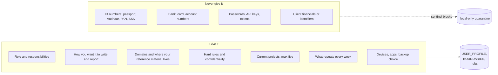

# What to tell it about a person

The brain is only as good as what it knows about its owner. This page lists what to give it, why each piece matters, and what never to give it. The onboarding interview asks for all of this, one question at a time with suggested answers; every question is listed in [onboarding-interview.md](onboarding-interview.md). You can also fill `99-Meta/USER_PROFILE.md` by hand.

## The short version

Give it how you work, not who you are on paper. Your role, your week, your domains, your tone, your rules and your recurring tasks matter far more than your biography.

## What to give, and why

| Information | Example | Why it helps | Goes to |
|---|---|---|---|
| Name and what to call you | "Meera. Not Ma'am." | Drafts and greetings sound right | USER_PROFILE |
| Role and organisation | "Partner, a 40-person tax and advisory firm" | Sets the level, vocabulary and stakes of every draft | USER_PROFILE |
| A normal week | "Client reviews Mon-Tue, team Wed, writing Thu-Fri" | Daily and weekly prompts land on the right day | USER_PROFILE |
| What you own versus oversee | "I own two client relationships; I oversee the research desk" | Decides whether it drafts for you to send or summaries for you to review | USER_PROFILE |
| Who you answer to and who answers to you (roles) | "Managing partner; six team leads" | Tone of upward versus downward drafts | USER_PROFILE |
| Time zone | "IST" | Dates, deadlines, meeting prep | USER_PROFILE |
| Tone rules | "Short. No em dashes. Indian English." | Every piece of writing | USER_PROFILE |
| Answer order and report style | "Answer first. Brief status blocks." | How every reply is shaped | USER_PROFILE |
| When unsure | "Decide and flag, except client-facing" | How often it asks you questions | USER_PROFILE |
| Domains and your role in each | "Indirect tax: expert. AI programme: decider." | Depth and which skills to use | USER_PROFILE, 02-Areas |
| Where reference material lives | "Circulars in a SharePoint folder" | Research starts from your sources | 03-Resources |
| Hard rules | "Never quote fees. Never name clients." | Enforced on every request | BOUNDARIES (your section) |
| Confidential categories | "Client financials, HR matters" | Kept out of notes entirely | BOUNDARIES |
| Current projects | "Q4 partner update, due 15 Dec" | First hubs; the brain knows what matters now | 01-Projects |
| Recurring tasks | "Summarise each new circular for clients" | Seeds for the first skills it learns | PATTERN_LOG |
| Two or three samples of your writing | Past articles or emails | It learns your voice | 02-Areas/writing |
| Devices and apps | "Windows tablet, Outlook, Teams, Excel" | Which connections to suggest | USER_PROFILE |
| Backup preference | "Private GitHub" or "this laptop only" | Whether git-sync is set up | USER_PROFILE |

## Useful but optional

- Other AI tools you use and what for.
- Your target audience for writing (clients, partners, the public).
- Professional codes that govern your work, so drafts respect them.
- Words and phrases you hate.
- The one task this week that would make you keep using it.

## Never give it

| Category | Examples | What happens if it appears |
|---|---|---|
| Government IDs | passport, national ID, Aadhaar, PAN, SSN, driver's licence, visa numbers | Not written; sentinel blocks and quarantines if found |
| Financial account details | bank account, IFSC with account, card numbers | Same |
| Credentials | passwords, API keys, tokens, private keys | Same |
| Client identifiers and financials | client PAN or GSTIN, tax computations, balances | Kept out by your owner rules |
| Health, legal disputes, HR cases | anything you would not want in a settings page | Keep it out of the vault |

Referring to a document is fine: "passport scan is in the grey folder at home". Its number is not.

## Setting it up for someone else

If you are setting up a copy for a family member or colleague:

1. They get their own copy, their own Claude account, and their own machine or folder. Never put their material in your vault.
2. Run the interview with them, not about them. Their words go into their profile.
3. For professionals with clients, add the confidentiality block in [safety.md](safety.md) during Block 4.
4. Hand over after the first-win task. The pilot fails if it only works with you in the room.

## Keeping it current

- `/weekly` asks "is anything in your profile no longer true?"
- Say "I changed roles" or "I stopped doing X" at any time and it proposes the diff.
- `/onboard redo block <n>` re-runs one section.
