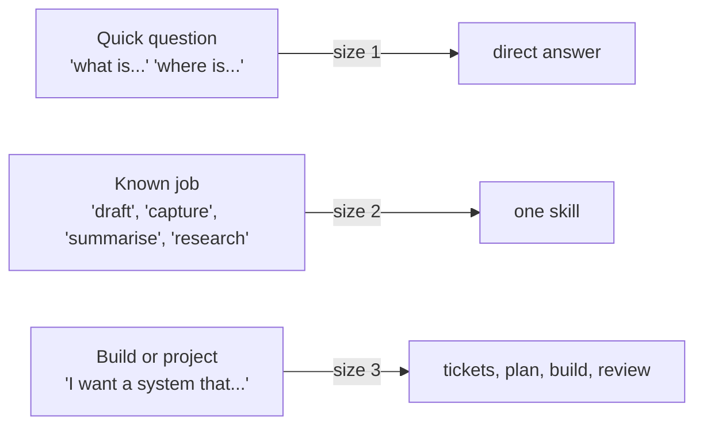

# Prompt guide

You do not need special syntax. This page shows what makes a request land well, and gives you 70 prompts to copy, grouped by the kind of work you do. Replace anything in angle brackets.

## Anatomy of a good request

```text
Goal:        what done looks like, in one line          (required)
Home:        which project or area, or "new project"     (helps filing)
Stakes:      real data? money? a client? hard to undo?    (changes the model tier)
Constraints: deadline, decisions already made, what you already tried
```

Example, all four parts in two sentences:

```text
Draft the Q4 update for the partners' meeting from 01-Projects/ai-pilot, one page,
recommendation first. It goes to partners only, and we already decided not to pilot tool B.
```

## Match the ceremony to the size



| Signal words | Size | You get |
|---|---|---|
| what, where, when, remind me, which file | 1 | An answer, often short |
| draft, reply, summarise, capture, ingest, research, compare, review | 2 | The matching skill's procedure and a brief report |
| build, set up, automate, plan, a system for, every month | 3 | Tickets first, then work in stages |

## Habits that make it better

- **Name the stakes.** "This goes to a client" or "this touches real payroll data" moves the work to a more careful tier and triggers extra review.
- **Point at the source.** "From 01-Projects/x/" or "from the three PDFs I just attached" beats "from my notes".
- **Say what already happened.** Decisions already made are not re-litigated if you say so.
- **Ask for the shape.** "One page", "5 bullets", "a table with these columns".
- **Let it ask.** If routing is unclear it will ask one question. Answer it and it proceeds.
- **Check the routing line.** If the first line does not name a skill or agent for a substantive task, say "route that through the skill map" and it will redo it properly.
- **Close the loop.** "Log this as a pattern" when you notice yourself doing something by hand again.

## Prompt library

### Everyday (any role)

1. `Start today's journal and tell me the one thing that has to move today.`
2. `Capture: <thought>. Don't file it yet.`
3. `Process my inbox. Suggest where each item goes; I'll approve.`
4. `Where did I leave off on <project>, and what's the single next move?`
5. `Save this article and tell me what in my vault it connects to: <url>`
6. `Turn these rough notes into a clean note in the right folder: <paste>`
7. `What's waiting on me across all projects? Only things I have to act on.`
8. `Remind me what we decided about <topic> and where that's written down.`
9. `Summarise this week in five lines for my own records.`
10. `Weekly review. Also tell me what I did three times that you could take over.`

### Managers and partners

11. `Turn my notes from today's team check-in into action items per person, with owners and dates I mentioned. Don't invent dates.`
12. `Draft a one-page update for the partners' meeting on <topic> from 01-Projects/<x>. Recommendation first, then evidence, then asks.`
13. `Make a 10-slide deck for <audience> on <topic>, 15 minutes, answer-first. Show me the outline before building.`
14. `Council this: <decision>. Budget is <x>, constraints are <y>.`
15. `Prepare me for tomorrow's meeting with <role> about <topic>: what they likely want, what I need to decide, three questions to ask.`
16. `Draft a firm but warm reply declining <request>, keeping the relationship.`
17. `Set up a project to track <initiative> with a hub, a goal, and the agents that should work on it.`
18. `List every open delegation I've mentioned in the journal this month and whether it came back.`
19. `Turn this long email thread into: decision needed, options, my recommendation. <paste>`
20. `Draft performance-conversation talking points from these observations. Keep it factual, no labels. <paste>`

### Consultants and advisors

21. `Research <client industry> for a first meeting: market size, top 5 players, 3 recent changes, sources required.`
22. `Draft a proposal outline for <engagement>: problem, approach in phases, deliverables, timeline, what we need from the client.`
23. `Turn the workshop notes in 01-Projects/<x>/ into a findings memo: 5 findings, evidence for each, one recommendation each.`
24. `Compare these three vendor options on cost, data location, integration effort and lock-in. Table, then a recommendation.`
25. `Write the executive summary for this report in 200 words, for a CFO who will read nothing else.`
26. `Pressure-test this recommendation: what would a sceptical client say, and how do we answer?`
27. `Make me a reusable checklist for <recurring deliverable> from the last two I did.`
28. `Use client codes, not names, in everything you write for this project.`

### Tax, legal and compliance professionals

29. `Summarise this new circular into a one-page client note: what changed, who is affected, effective date, action needed. <paste or attach>`
30. `Research the current text of <rule or section> from primary sources and note anything amended this year.`
31. `Compare the old and new versions of this clause and list every substantive change. <paste both>`
32. `Draft a reply to this client query in plain language, with the caveats I should keep. Mark anything that needs my professional judgment.`
33. `Build a tracker of filing and compliance deadlines for the next quarter from these notes. No client names, codes only.`
34. `Make me a skill for turning circulars into client notes, using these two examples as the style.`

### Writers and communicators

35. `Here are three pieces I wrote. Learn the voice and save a style guide to 02-Areas/writing/.`
36. `Outline an article on <topic> for <audience>, 1,200 words, with a strong opening and one clear argument.`
37. `Draft the article from the approved outline in my voice. No em dashes, no clichés.`
38. `Edit this draft for clarity and length. Show changes as a diff, don't rewrite my voice. <paste>`
39. `Give me ten headline options for this piece, from plain to bold.`
40. `Turn this article into a LinkedIn post of under 200 words and a three-point summary for an internal newsletter.`
41. `Find three recent, sourced data points that support or challenge this argument: <argument>`
42. `Set up a writing pipeline project: ideas list, drafts in progress, published, with a weekly review of it.`

### Researchers and students

43. `I'm starting <course or research topic>. Set up an area with a concept-note template and a reading list note.`
44. `Explain <concept> from intuition to formula, then quiz me with five questions.`
45. `Summarise this paper: question, method, key result, limitations, what it means for my project. <attach>`
46. `Find the five most cited recent papers on <topic> and what each one claims. Sources required.`
47. `Turn my lecture notes into concept notes and link them to what I already have.`
48. `Draft a literature review section from these ten resource notes. Cite each claim.`
49. `Plan my study for the exam on <date>: topics, order, practice questions per week.`
50. `Review my essay against this rubric and tell me the three highest-value fixes. <paste both>`

### Developers and technical builders

51. `/plan a small tool that <does X>. Stack: Python. Stakes: reads real customer data, never writes to it.`
52. `Run builder on TICK-001.`
53. `Have coder implement TICK-001, then run code-review on it.`
54. `This test fails: <paste>. Debug it systematically; name the root cause before any fix.`
55. `Help me understand this repo. Read incrementally and tell me the entry point, the main flow and where <feature> lives.`
56. `Review this diff for over-engineering and give me a delete list.`
57. `Write a HANDOFF.yaml so another model can pick this up tomorrow.`
58. `Package this ticket as a self-contained prompt for another model, then review what it sends back.`

### Finance and markets

59. `Explain <instrument or concept> trader-first: intuition, a money example, then the formula.`
60. `Quiz me on <topic> at interview level, one question at a time, and grade my answers honestly.`
61. `Research <company>: business model, last four quarters' results, key risks. Primary sources only.`
62. `Turn this spreadsheet of monthly numbers into a variance summary: top 5 drivers, one line each.`
63. `Write a one-page investment memo template I can reuse.`

### Running the brain itself

64. `/audit, and tell me which three skills I could retire.`
65. `What's in PATTERN_LOG that's close to three repeats?`
66. `Show me the proposed skills waiting for approval, one line each.`
67. `Promote <proposed skill> to live and register it everywhere it needs to be.`
68. `I stopped doing <X>. Update my profile and archive the related project.`
69. `Set up a daily private backup of this vault. Explain what you need from me first.`
70. `Is anything in my vault that shouldn't be there? Run sentinel over everything.`

## Prompts that do not work well

| Instead of | Say |
|---|---|
| "Do everything for this project" | "Plan this project" (then approve tickets one by one) |
| "Send this to the client" | "Draft this for the client" (the brain never sends) |
| "Remember my card number" | Nothing. It will refuse, by design |
| "Fix my notes" | "Run the janitor and show me the report" |
| "Make it better" | "Make it shorter, lead with the recommendation, remove jargon" |
