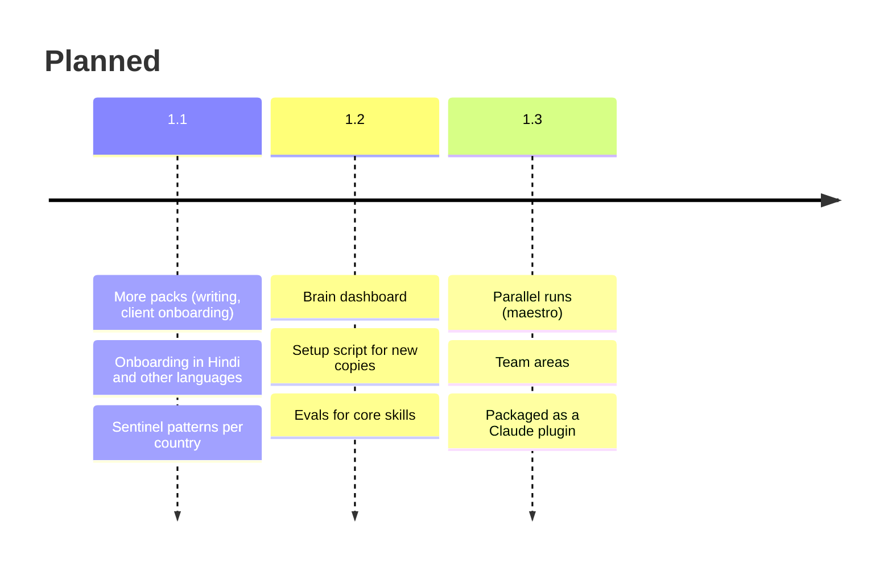

# Roadmap: what is new and what to explore

## New in 1.0 (September 2026)

- First public release of the template, extracted from a private vault used daily for three months.
- `onboard` skill and `/onboard`: a nine-block interview that writes your profile, rules and first project hubs, so the brain starts from you, not from the author.
- Ten new slash commands for the everyday loop: `/onboard`, `/capture`, `/inbox`, `/ingest`, `/research`, `/new-project`, `/plan`, `/council`, `/handoff`, `/weekly`.
- BOUNDARIES split into universal rules and an owner-specific section, with a ready-made professional confidentiality block.
- Model tiers made portable: tier names you map to your own models.
- Three optional packs: job-search (2 agents, 7 skills), LinkedIn (1 agent, 4 skills), trading (10 skills).
- A `version:` line on every agent and skill, and a versions page mapping tiers to current Claude models.
- Full documentation with diagrams, a 70-prompt library, and fictional worked examples.

## Coming next

| Item | What it is | Status |
|---|---|---|
| More packs | Writing and publishing pipeline, client onboarding, meeting minutes | Planned |
| Multilingual onboarding | The interview and daily prompts in Hindi first, then other languages | Planned |
| Sentinel pattern sets | Ready patterns for GSTIN, UK NI numbers, EU IBANs, and similar | Planned |
| Brain dashboard | A local HTML dashboard of projects, tickets, inbox age and skill usage, regenerated by a script | Exists privately, needs generalising |
| Setup script | One command that copies the template, asks your name, and opens the interview | Planned |
| Skill evals | Small test sets so a changed skill can be checked before it goes live | Planned |
| maestro | A conductor agent that runs several tickets in parallel across git worktrees, serial-first until proven | Exists privately, needs a tool-agnostic version |
| Team areas | A shared folder several people's brains can read, with per-person vaults kept private | Design stage |
| Plugin packaging | The portable skills and commands as an installable Claude plugin | Planned |

## More options to explore

Ideas that fit the architecture. Pick one, build it as a skill or agent, and send a pull request.

**Capture from anywhere**
- Phone capture through Obsidian mobile into `00-Inbox/`, processed on desktop.
- Voice notes: record, transcribe, `/capture` the transcript.
- Email to inbox: a connector or rule that files forwarded emails as Inbox notes.

**Connect your tools** (through Claude's connectors, always within BOUNDARIES)
- Calendar: `/daily` pulls today's meetings and prepares a line for each.
- Email: draft replies into a folder for you to send.
- Drive or SharePoint: `/ingest` works on documents, not just URLs.

**New specialist skills people keep asking for**
- Meeting minutes (decisions, actions, open questions)
- Circular or regulation to client note
- Proposal builder for consultants
- Grant and scholarship applications
- Personal finance review (without account numbers)
- Reading list and book notes
- Travel planner that files itineraries per trip

**Sub-brain ideas**
- Writing and publishing pipeline
- Client onboarding
- Hiring pipeline
- Research lab notebook

**Bigger experiments**
- A scheduled morning brief built from the journal, hubs and calendar.
- Skill-creator running on a schedule and proposing weekly.
- Comparing models on your own tasks and logging results in MODEL_SELECTOR.
- A graph-view colour scheme for Obsidian that separates agents, skills, projects and journal.

## Pilot programme

The first outside pilots are professionals outside software. What each pilot measures:

| Week | Measure |
|---|---|
| 0 | Time to onboard; questions skipped or confusing |
| 1 | Is the routing line present; does the owner use it unprompted |
| 2 | Inbox cleared; journal kept; anything abandoned |
| 3 | Are skill-creator's proposals the owner's real patterns |
| 4 | Keep, change, drop; findings fed back into the interview and docs |

Want to pilot it for your profession? Open an issue titled "Pilot: <profession>" with no personal details, and say what your week looks like.
