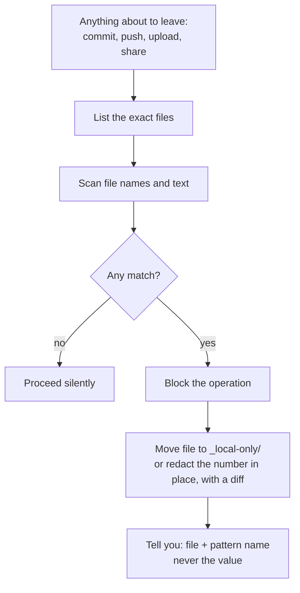

# Safety and privacy

A second brain holds the most personal material you have. This page explains every safeguard, what it does and does not cover, and how to add your own.

## The short version

| Risk | Safeguard |
|---|---|
| Something gets deleted by mistake | Nothing is deleted from active folders. Notes move to `04-Archives/`. Only the reaper deletes, after 30 days, from a list you can veto |
| A secret or ID number ends up in git or an upload | Sentinel scans before anything leaves the machine and blocks it |
| It never should have been written down | Boundaries forbid writing ID, card and bank numbers or credentials into any note |
| It acts on your behalf | It never sends, submits, posts, signs or pays. Drafts only |
| It spends money | Never without you confirming that specific action, every time |
| It rewrites a lot at once | No mass rewrites without a diff you review |
| It changes its own rules | FOUNDATION and BOUNDARIES are owner-edited only |
| A scheduled job goes wrong at night | Kill switch file stops every unattended agent |
| Two assistants write the same file | Advisory lock in ACTIVE_SESSION.md |

## Boundaries

`99-Meta/BOUNDARIES.md` has two parts.

**Universal rules** ship with every copy and should not be removed: the vault, data and secrets, things only the owner does, leaving the machine, tone, scope, unattended runs, and the loop itself.

**Owner-specific rules** are written during onboarding (Block 4) and only with your explicit approval. Typical examples:

- Client names replaced with codes in every note.
- No client financial figures or identifiers.
- A list of approved storage locations.
- Topics that never go in the vault (HR matters, medical, legal disputes).

When a request would cross a boundary, Claude refuses and cites the file. It does not look for a way around it.

## Sentinel



What it looks for:
- Passport, national ID, Aadhaar, PAN, SSN, driver's licence, voter ID
- Visa, residence and immigration document numbers
- Bank account, routing, card numbers (Luhn-checked)
- API keys, tokens, passwords, private keys, GitHub tokens
- Any image or PDF whose file or folder name matches an ID pattern, without opening it

What it does not do:
- It is pattern matching. It can miss a number written in an unusual format, and it will not recognise confidential prose ("our client is being acquired"). Your owner rules and your own review cover that.
- It does not scan archives at rest; it scans whatever is about to leave.
- It is not a password manager.

Add patterns for your country or profession (for example GSTIN, a company registration number format) in `99-Meta/agents/sentinel.md` under "Detection patterns".

## Where your data goes

- The vault is plain files on your disk. Nothing in this template phones home.
- When you talk to Claude, the files it reads are sent to Claude as part of that conversation, under your Claude account's terms and settings.
- If you connect other services (email, drive, calendar) through Claude, the boundaries still apply: vault content is only sent to services you approved.
- If you back up to GitHub, use a private repository and your own credentials, stored in your system's git credential store, never in a note.

## For consultants, lawyers, accountants and anyone with clients

Add this to your owner rules during onboarding, then adjust:

```markdown
### Professional confidentiality
- Client names are codes (C-01, C-02). The key stays outside the vault.
- No client financials, tax computations, identifiers or account numbers in any note.
- Nothing drafted for a client leaves without my review. Drafts only.
- Client documents are summarised, not copied in full, unless I say otherwise.
- Approved locations for client material: <firm system>, this vault. Nothing else.
```

Also check your firm's policy on AI tools and on where client data may be processed before you put any client material in the vault.

## Unattended and scheduled runs

- Always allowed: reading the vault, running the local scripts, drafting into the Inbox and Journal, preparing reports.
- Never allowed unattended: sending or submitting anything, spending money, pushing without a clean sentinel pass, deleting outside the reaper lifecycle, editing FOUNDATION or BOUNDARIES.
- Every unattended run logs what it did to the journal.
- Kill switch: create an empty file `_local-only/AUTONOMY_OFF`. Every scheduled agent checks for it first and does nothing while it exists.

## Sharing your setup

- Share skills and agents, never your vault. Your profile, journal, pattern log and projects are personal.
- Before publishing anything derived from your vault, run `/sentinel` and search for your own name, your clients' names and your employer.
- Contributions to this repository must use fictional examples only. See [CONTRIBUTING.md](../CONTRIBUTING.md).
