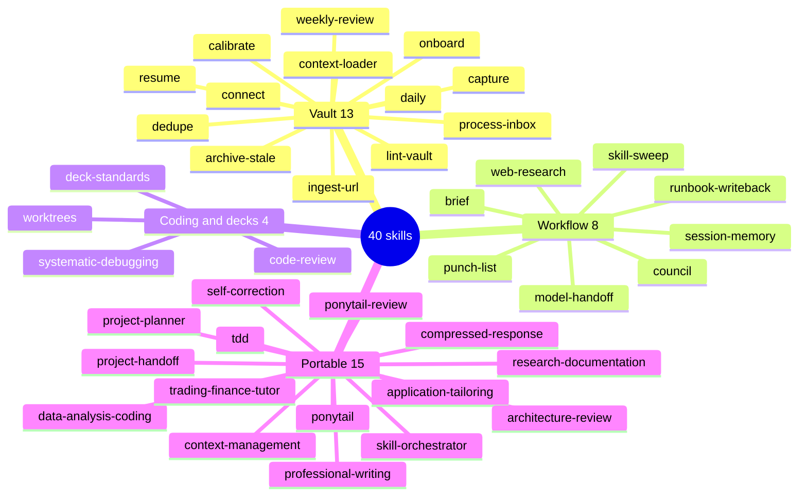
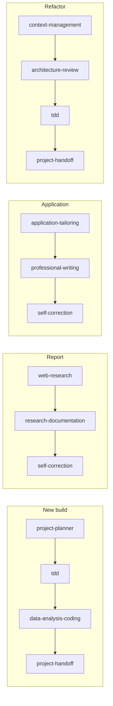

# Skills

40 skills in four groups. A skill is a written procedure for one kind of task; an agent may use several. Each file has a trigger, inputs, outputs, when to use, when NOT to use, the procedure, and an example.



## Vault skills (`99-Meta/skills/vault/`)

The daily machinery of a second brain.

| Skill | What it does | Say | Produces |
|---|---|---|---|
| onboard | First-run interview (quick, standard or deep), suggested answers, resumable, ends with a portrait of how you work | automatic on first run, `/onboard` | USER_PROFILE, BOUNDARIES owner section, hubs, voice, portrait |
| calibrate | Two or three tuning questions a week, based on what actually happened | `/calibrate`, after `/weekly` | Approved profile updates |
| context-loader | Session-start ritual: loads foundation, profile, rules, inbox count, journal status | `/cold-start` | One-line status |
| capture | Drops a thought or link into the Inbox with frontmatter, no filing decisions | `/capture ...`, "capture this" | `00-Inbox/YYYY-MM-DD slug.md` |
| process-inbox | Proposes a home for every Inbox item; moves on approval | `/inbox` | Empty Inbox |
| daily | Today's journal with yesterday's open items carried over | `/daily` | `05-Journal/YYYY-MM-DD.md` |
| weekly-review | Wins, blockers, patterns, unfinished items; container for the janitor's weekly findings | `/weekly` | `05-Journal/YYYY-Www-review.md` |
| connect | Finds genuinely related notes and proposes links both ways | "connect this note" | Proposed links |
| ingest-url | Turns an article into a resource note: what it says, what holds up, what it connects to | `/ingest <url>` | `03-Resources/` note |
| resume | Where the work stopped and the one next move | `/resume` | Short status plus one recommendation |
| lint-vault | Broken links, orphans, missing frontmatter, bad dates, stray root files. Report only | via `/janitor` | Issue report |
| dedupe | Flags near-duplicate notes. Never merges by itself | weekly | Duplicate pairs |
| archive-stale | Proposes archiving dormant project notes | weekly | Archive proposals |

## Workflow skills (`99-Meta/skills/workflow/`)

How work gets reported, researched, decided and continued.

| Skill | What it does | Say |
|---|---|---|
| brief | Default report after work: one block per task with did, needs, next | automatic |
| web-research | Query wide, open real pages, extract with citations, cross-check, grade every claim | `/research ...` |
| council | Five advisors with different frames review a hard decision, then a chairman verdict and the strongest counter-argument | `/council ...` |
| session-memory | Continuity across sessions from the journal and HANDOFF.yaml, no third-party memory service | automatic at session end |
| model-handoff | Packages a self-contained prompt for another AI model to write code, then reviews what comes back | "hand this off to another model" |
| punch-list | One deduplicated list of items waiting on you from unattended runs, with sighting counts | automatic |
| runbook-writeback | When a run works around a defect in its own procedure, it writes the fix as a reviewable diff | automatic |
| skill-sweep | Scheduled twice-weekly: counts patterns, drafts proposals, refreshes the health snapshot | scheduled |

What a brief looks like:

```text
Client note: GST circular 12/2026
- did: one-page note drafted in 01-Projects/client-updates/, 3 sources cited
- needs: your review before it goes to anyone
- next: same format for circular 13 when it lands

Inbox
- did: 7 items filed, 2 archived
```

## Coding and presentation skills

| Skill | What it does |
|---|---|
| code-review | Checks a diff against the ticket's acceptance criteria and grades findings; critical findings block "done" |
| systematic-debugging | Four phases (reproduce by reading, isolate, name the root cause, minimal fix) before touching code |
| worktrees | One git branch and folder per ticket so parallel work never collides; verifies a clean baseline first |
| deck-standards | Rules for decks as arguments: action titles, the ghost-deck test (titles alone tell the story), one exhibit per slide, structure by register |

## Portable skills (`skills/`)

These are full Claude skills. They work inside the vault, and you can also install them into Claude's own skill store (rename `<name>.md` to `SKILL.md` inside its folder) so they trigger in any chat.

| Skill | What it does | Good for |
|---|---|---|
| skill-orchestrator | Picks and orders several skills for a multi-phase task and says the chain before starting | "Help me set up X from scratch" |
| project-planner | Design conversation first, then a YAML plan: capabilities, what already exists, architecture, tasks | Anything that does not exist yet |
| project-handoff | `HANDOFF.yaml` with current state, next steps, key files, run instructions, errors solved | Pausing work, switching models, handing to a person |
| self-correction | Internal quality pass before any substantive answer: did it answer the question, are the numbers right | Automatic |
| professional-writing | Emails and messages that sound like a person, not a model | "Reply to this", "draft an email to" |
| research-documentation | Reports and papers: structure first, human tone, formulas and data placed deliberately | "Write a report on" |
| application-tailoring | Job, program and grant applications from an inventory of your experience, matched to the role | "Help me answer this application question" |
| compressed-response | Short answers for quick lookups; `/caveman` for ultra-short, `/normal` to exit | Follow-up questions |
| context-management | Explores a large codebase or folder incrementally instead of reading everything | "Help me understand this repo" |
| architecture-review | Restructures existing code only with tests as a safety net | "This code is messy, clean it up" |
| data-analysis-coding | Readable, commented, pandas-first Python; you run it, Claude traces it | "Clean this data", "analyse this CSV" |
| tdd | Tests before implementation for anything substantial | "Build this with tests" |
| ponytail | The lazy senior developer ladder: reuse, then standard library, then one line, then the minimum | All coding output |
| ponytail-review | Reviews a diff for over-engineering and hands back a delete list | "Is this over-built?" |
| trading-finance-tutor | Finance and markets taught trader-first: intuition, a money example, then the formula | "Explain convexity", interview prep |

## How skills chain

skill-orchestrator assembles chains like these so a multi-phase request never gets squeezed into one skill:



## Adding a skill

Ask skill-creator ("make me a skill for...") or follow [customizing.md](customizing.md). A new skill is not live until it has a row in `99-Meta/SKILL_MAP.md`.
