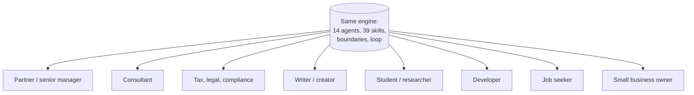

# Use cases

The same engine, set up differently by the onboarding interview. Each profile below is fictional; the setups are realistic.

## Partner or senior manager

**Their week.** Client reviews, internal check-ins, decisions, delegation, board or partner updates.

| Setup | |
|---|---|
| Areas | team management, AI programme, business development |
| Projects | quarterly partner update, one project per major initiative |
| Owner rules | client codes, no HR matters in the vault, drafts only |
| Most used | `/daily`, meeting notes to actions, `/council`, deck-builder, `/weekly` |
| Likely first learned skill | meeting minutes, or "delegation tracker" |

**A typical day.** `/daily` in the morning shows the three open delegations from yesterday. After each call, paste notes: "actions per person, no invented dates". Before a decision: `/council`. Friday: `/weekly` answers "what did I do three times this week", which is how the brain earns its next skill.

## Consultant

| Setup | |
|---|---|
| Areas | each practice area, methods library |
| Projects | one per engagement, with a hub and decisions log |
| Most used | `/research` before meetings, proposal outlines, findings memos, vendor comparisons |
| Sub-brain candidate | proposal pipeline: research, outline, pricing notes, draft, review |

## Tax, legal and compliance professional

| Setup | |
|---|---|
| Areas | each regime or practice area, with concept notes per provision |
| Resources | circulars, judgments, notifications ingested with source links |
| Owner rules | codes not names, no computations or identifiers, primary sources for research, human judgment flagged |
| Most used | circular-to-client-note, clause comparison, `/research` with "primary sources only", deadline tracker |
| Sentinel additions | local identifiers such as GSTIN or company registration numbers |

## Writer or creator

| Setup | |
|---|---|
| Areas | writing, with a style guide learned from past pieces |
| Projects | a pipeline hub: ideas, drafting, published |
| Most used | outline, draft in voice, edit as diff, repurpose to posts |
| Sub-brain candidate | the writing pipeline itself, with topic-finder, outliner and style-editor specialists |

## Student or researcher

| Setup | |
|---|---|
| Areas | one per course or research theme, concept notes with intuition, formula and links |
| Most used | paper summaries, `/research`, quiz me, literature review drafts, exam plans |
| Portable skills | trading-finance-tutor style teaching, research-documentation for papers |

## Developer

| Setup | |
|---|---|
| Projects | one per repo, `tickets/` inside, `HANDOFF.yaml` at the root of each repo |
| Most used | `/plan`, builder, coder, code-review, systematic-debugging, worktrees, ponytail-review |
| Agents | github-manager for project repos, git-sync for the vault |

## Job seeker

| Setup | |
|---|---|
| Projects | job search, with a tracker and one folder per application |
| Most used | application-tailoring, professional-writing, `/research` on each company, interview prep |
| Sub-brain candidate | the original author's first sub-brain was exactly this: JD decoder, bullet writer, resume critic, interview defender |
| Rule | the brain drafts every application; you submit every application |

## Small business owner

| Setup | |
|---|---|
| Areas | customers, suppliers, finances, marketing |
| Projects | launches, hiring, a website refresh |
| Most used | email drafts, supplier comparisons, monthly numbers summarised, simple tools via `/plan` |
| Owner rules | no bank or card numbers anywhere, drafts only for customers |

## Family or team use

Each person gets their own copy and their own onboarding. Share skills, not vaults: if one person builds a useful skill, copy the skill file across. A shared team area is on the [roadmap](roadmap.md).
