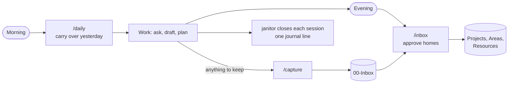
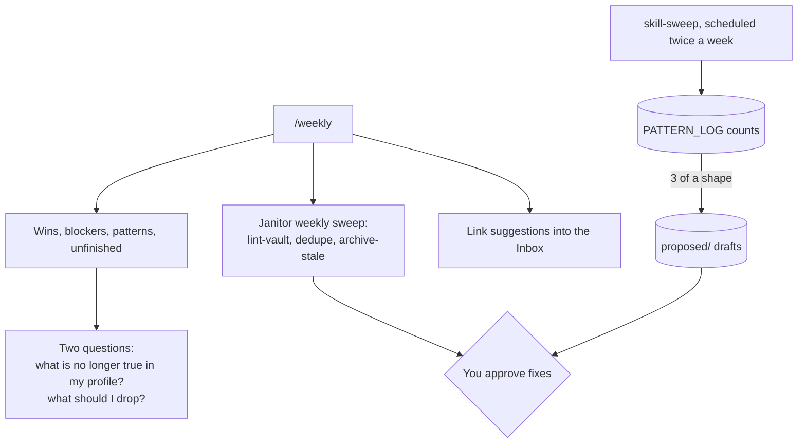
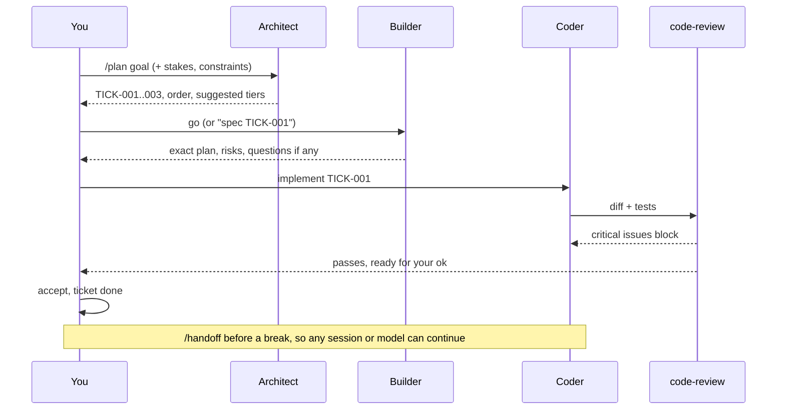
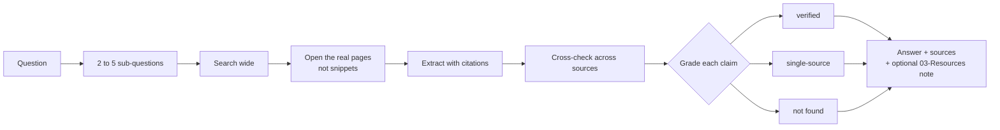
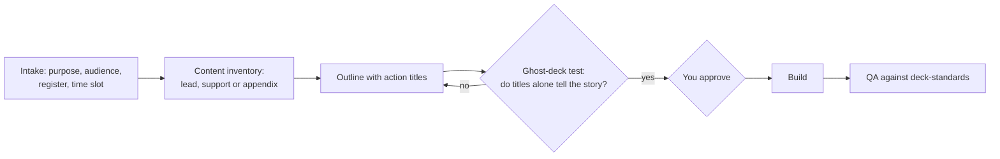
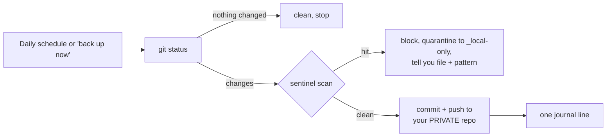

# Workflows

The recurring loops that make the brain useful, each with the commands that drive it.

## 1. The daily loop

| When | Command | Minutes |
|---|---|---|
| Start of day | `/daily` | 1 |
| Throughout | `/capture <thought>` | seconds |
| Picking something back up | `/resume` | 1 |
| End of day | `/inbox` | 5 |

Capture is cheap and happens anywhere, including from your phone into `00-Inbox/`. Filing happens once a day, with you approving.

## 2. The weekly loop

Reaper runs weekly too: stale notes move to Archives; items 30+ days in Archives appear on a delete manifest in your Inbox. Strike anything you want to keep.

## 3. A project, start to finish

Useful lines along the way:
- "What can run in parallel?" (architect flags independent tickets)
- "Kick TICK-002 back to the architect, it's really two things."
- "Use the high-stakes tier for this one, it touches real payroll data."
- "/handoff" before switching to another model or stopping for the week.

## 4. Research that holds up

Say `/research <question>`. Add "primary sources only" for regulations, filings and official data.

## 5. Writing in your voice

1. Once: "Here are three pieces I wrote. Learn the voice and save a style guide to 02-Areas/writing/."
2. Per piece: outline, approve, draft, edit as a diff.
3. After a few pieces, skill-creator will likely propose a writing skill tuned to you. If you publish regularly, the writing pipeline is a good sub-brain candidate.

## 6. Decks

## 7. Decisions under uncertainty

`/council <decision + context>`. Five advisors (for example the optimist, the sceptic, the operator, the customer, the long-term view) reason separately, critique each other, and a chairman returns one recommendation, the strongest counter-argument, and what would change the call.

## 8. Handing work to another model or person

- `/handoff` writes `HANDOFF.yaml`: state, next steps, files, how to run, conventions, errors already solved.
- "Package this for another model" (model-handoff) writes a self-contained prompt, then reviews what comes back through code-review before anything is accepted.

## 9. Backup

Git-sync never force-pushes, never merges, never resolves conflicts. If the remote disagrees, it stops and tells you.

## 10. Growing the toolkit

| Signal | What happens |
|---|---|
| A request had no matching skill | One PATTERN_LOG line |
| The same shape three times | skill-creator drafts into `proposed/` |
| You approve | Moves to live, SKILL_MAP row, librarian indexes it |
| Monthly `/audit` | Overlaps, dead skills and contradictions proposed as diffs |
| A project runs a multi-role pipeline | Consider a sub-brain (`99-Meta/SUB_BRAIN_PATTERN.md`) |
