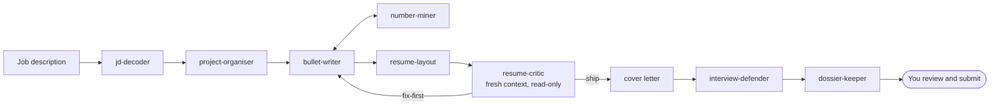

# Job-search pack

A sub-brain for job applications: JD in, tailored one-page resume, cover letter and interview defense sheet out. The brain drafts everything; you submit.

| File | Kind | Job |
|---|---|---|
| agents/job-coordinator.md | agent (careful) | Runs the pipeline, delegates every step |
| agents/dossier-keeper.md | agent (fast) | One findable record per application |
| skills/jd-decoder.md | skill | JD into a structured profile |
| skills/project-organiser.md | skill | Every project in a tagged box |
| skills/bullet-writer.md | skill | Verb + artifact + method + number |
| skills/number-miner.md | skill | Real numbers dug from artifacts |
| skills/resume-layout.md | skill | Line budget, one page, no orphans, measured |
| skills/resume-critic.md | skill | Fresh-eyes five-reader review, read-only |
| skills/interview-defender.md | skill | Follow-up questions and honest answers |
| templates/ | files | RESUME_RULES, ROLE_BUNDLES, CORRECTIONS, PROJECT_BANK, tracker |

## Install

1. Copy `agents/*` into `99-Meta/agents/` and `skills/*` into `99-Meta/skills/job-search/`.
2. Create `01-Projects/job-search/` and copy `templates/*` into it. Add your master resume (LaTeX or Word) and an experience inventory.
3. Add these rows to `99-Meta/SKILL_MAP.md` under "Project sub-brains" and the agents table, and the two agents to `MODEL_SELECTOR.md`.
4. Say: "Set up the job-search sub-brain" and let the coordinator walk you through filling the project bank.

## Needs

- LaTeX (`pdflatex`) or Word for the resume; `pdftotext` and `pdfplumber` for checks; LibreOffice for the Word round-trip.
- Portable skills already in the core: application-tailoring, professional-writing, self-correction.
