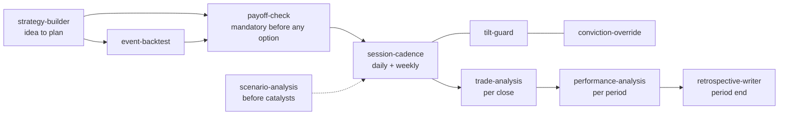

# Trading pack

Ten skills for running a discretionary trading book with rules, built from a real multi-week live trading challenge and generalised. They cover the whole lifecycle: idea, pre-trade checks, daily running, behaviour, and review.

| Skill | When | Job |
|---|---|---|
| strategy-builder | New idea or account | Thesis with a falsifier, data check, instrument choice, sizing from risk, exits before entries, catalyst map, rails |
| event-backtest | A trade anchored to earnings, CPI, FOMC and similar | How this name reacted before; what options already price |
| payoff-check | Before any option order, always | P&L at the trader's own forecast; stops inverted structures |
| session-cadence | Every trading day, plus weekly | Book vs tracker diff, tripwires, calendar, expiring options, weekly compliance sweep |
| tilt-guard | Live, on specific phrases | Names a behavioural pattern once and routes to a protocol |
| conviction-override | A rule fires and the trader wants to hold | Halve, new floor, confirmation trigger, both paths logged |
| scenario-analysis | Before catalysts or on demand | Book impact per scenario vs the drawdown ladder |
| trade-analysis | Every closed trade | Thesis, execution and rules scored separately |
| performance-analysis | Period end | Return, risk, attribution, process vs luck |
| retrospective-writer | Period end | The written review, decision-type attribution at the centre |

## Install

1. Copy `skills/*` into `99-Meta/skills/trading/` and add rows to `99-Meta/SKILL_MAP.md`.
2. Create `01-Projects/<your-book>/` with a tracker (positions, plan, tripwires, lessons) and a plan document from strategy-builder.
3. Connect a market-data or broker connector if you have one (read-only is enough). Without one, paste positions and prices.

## Rules this pack keeps

- It never places, modifies or cancels an order. It analyses and drafts tickets; you trade.
- It never runs against an employer's internal systems or anyone's credentials.
- Every number is from the tracker or a data pull, never from memory.
- This is analysis tooling, not investment advice.
